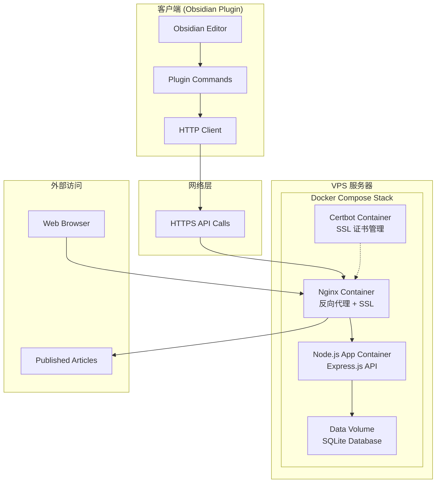

# Obsidian 发布系统 v0.1 设计文档

## 概览

本设计文档基于需求文档，详细描述了如何构建一个完整的 Obsidian 笔记发布系统。系统采用客户端-服务端架构，客户端为现有的 Obsidian 插件（修改 base URL），服务端为新开发的 Express.js 应用，使用 Docker 容器化部署在 VPS 服务器上。

## 架构

### 系统架构图



### 项目结构设计

```
publish-obsidian-plugin/
├── client/                     # Obsidian 插件源码
│   ├── main.ts                # 插件主入口
│   ├── src/
│   │   ├── obsius.ts          # API 客户端逻辑
│   │   ├── http.ts            # HTTP 工具
│   │   ├── text.ts            # 国际化文本
│   │   └── modals.ts          # UI 模态框
│   ├── manifest.json          # 插件清单
│   ├── package.json           # 客户端依赖
│   └── esbuild.config.mjs     # 构建配置
├── server/                     # Express 服务端
│   ├── src/
│   │   ├── app.ts             # Express 应用主文件
│   │   ├── routes/
│   │   │   ├── index.ts       # 路由定义
│   │   │   └── posts.ts       # 文章相关路由
│   │   ├── middleware/
│   │   │   ├── cors.ts        # CORS 中间件
│   │   │   ├── security.ts    # 安全中间件
│   │   │   └── logger.ts      # 日志中间件
│   │   ├── models/
│   │   │   ├── database.ts    # 数据库连接
│   │   │   └── post.ts        # 文章数据模型
│   │   ├── utils/
│   │   │   ├── idGenerator.ts # ID 生成器
│   │   │   └── markdown.ts    # Markdown 渲染
│   │   └── templates/
│   │       └── article.html   # 文章模板
│   ├── database/
│   │   └── posts.db          # SQLite 数据库文件
│   ├── package.json          # 服务端依赖
│   ├── Dockerfile            # 应用容器构建文件
│   └── nginx/
│       └── nginx.conf        # Nginx 反向代理配置
├── shared/                    # 共享类型定义
│   └── types.ts              # API 接口类型
├── docker-compose.yml        # Docker 服务编排文件
├── deploy.sh                 # 自动化部署脚本
├── main.js                   # 构建输出 (根目录)
├── manifest.json             # 符号链接到 client/
├── package.json              # 根 package.json (工作区)
└── README.md
```

## 组件和接口

### 客户端组件

#### 1. Base URL 配置
- **文件**: `client/src/obsius.ts`
- **修改**: 第4行 `const baseUrl = "https://share.141029.xyz";`
- **影响**: 所有 API 调用将指向新域名

#### 2. API 客户端保持不变
- **接口契约**: 维持现有的 `obsiusWrapper` 接口
- **HTTP 方法**: POST, PUT, DELETE 保持原有签名
- **错误处理**: 保持现有的 try-catch 模式

### 服务端组件

#### 1. Express 应用 (`server/src/app.ts`)
```typescript
import express from 'express';
import cors from 'cors';
import helmet from 'helmet';
import { postsRouter } from './routes/posts';
import { loggerMiddleware } from './middleware/logger';

const app = express();

// 中间件栈
app.use(helmet());
app.use(cors());
app.use(express.json());
app.use(loggerMiddleware);

// 路由
app.use('/', postsRouter);

export default app;
```

#### 2. 路由层 (`server/src/routes/posts.ts`)
```typescript
import express from 'express';
import { PostController } from '../controllers/postController';

const router = express.Router();
const postController = new PostController();

// API 端点
router.post('/', postController.createPost);
router.get('/:id', postController.getPost);
router.put('/:id', postController.updatePost);
router.delete('/:id', postController.deletePost);

export { router as postsRouter };
```

#### 3. 数据库模型 (`server/src/models/post.ts`)
```typescript
export interface Post {
  id: string;
  secret: string;
  title: string;
  content: string;
  created_at: string;
  updated_at: string;
}

export class PostModel {
  // SQLite 操作方法
  async create(post: Omit<Post, 'created_at' | 'updated_at'>): Promise<Post>;
  async findById(id: string): Promise<Post | null>;
  async update(id: string, updates: Partial<Post>): Promise<void>;
  async delete(id: string): Promise<void>;
}
```

## 数据模型

### SQLite 数据库 Schema

```sql
CREATE TABLE posts (
  id TEXT PRIMARY KEY,           -- 8位短ID (a1B2c3D4)
  secret TEXT NOT NULL,          -- UUID v4 用于验证
  title TEXT NOT NULL,          -- 文章标题
  content TEXT NOT NULL,        -- Markdown 内容
  created_at DATETIME DEFAULT CURRENT_TIMESTAMP,
  updated_at DATETIME DEFAULT CURRENT_TIMESTAMP
);

-- 索引优化
CREATE INDEX idx_posts_created_at ON posts(created_at);
CREATE UNIQUE INDEX idx_posts_id ON posts(id);
```

### API 接口规范

#### 创建文章 (POST /)
```typescript
// Request
interface CreatePostRequest {
  title: string;
  content: string;
}

// Response
interface CreatePostResponse {
  id: string;      // 8位短ID
  secret: string;  // UUID v4
}
```

#### 更新文章 (PUT /:id)
```typescript
// Request
interface UpdatePostRequest {
  secret: string;
  title: string;
  content: string;
}

// Response: 204 No Content
```

#### 删除文章 (DELETE /:id)
```typescript
// Request Body
interface DeletePostRequest {
  secret: string;
}

// Response: 204 No Content
```

#### 访问文章 (GET /:id)
```typescript
// Response: HTML页面或JSON数据
// Content-Type: text/html 或 application/json
```

## 错误处理

### 错误分类和处理策略

#### 1. 客户端错误处理
- **网络错误**: 保持现有的 `catch` 块和用户通知
- **API 错误**: 解析 HTTP 状态码和错误消息
- **验证错误**: 显示具体的字段错误信息

#### 2. 服务端错误处理
```typescript
// 全局错误处理中间件
app.use((err: Error, req: Request, res: Response, next: NextFunction) => {
  const statusCode = err.statusCode || 500;
  const message = err.message || 'Internal Server Error';
  
  res.status(statusCode).json({
    error: {
      code: statusCode,
      message: message,
      timestamp: new Date().toISOString()
    }
  });
});
```

#### 3. 错误码规范
- **400**: 请求参数错误
- **401**: Secret 验证失败
- **404**: 文章不存在
- **409**: ID 冲突 (重新生成)
- **500**: 服务器内部错误

## 安全设计

### 1. Secret 验证机制
```typescript
// Secret 生成 (UUID v4)
import { v4 as uuidv4 } from 'uuid';
const secret = uuidv4();

// Secret 验证
const validateSecret = (providedSecret: string, storedSecret: string): boolean => {
  return providedSecret === storedSecret;
};
```

### 2. 输入验证和清理
```typescript
// 使用 express-validator
import { body, validationResult } from 'express-validator';

const postValidation = [
  body('title').isLength({ min: 1, max: 200 }).escape(),
  body('content').isLength({ min: 1, max: 100000 }).trim(),
  body('secret').isUUID(4)
];
```

### 3. 安全中间件
```typescript
import helmet from 'helmet';
import rateLimit from 'express-rate-limit';

// 安全头部
app.use(helmet({
  contentSecurityPolicy: {
    directives: {
      defaultSrc: ["'self'"],
      styleSrc: ["'self'", "'unsafe-inline'"]
    }
  }
}));

// 请求限流
const limiter = rateLimit({
  windowMs: 15 * 60 * 1000, // 15分钟
  max: 100 // 最多100个请求
});
app.use(limiter);
```

## ID 生成策略

### 短 ID 生成算法
```typescript
export class IDGenerator {
  private static readonly CHARS = 'abcdefghijkmnpqrstuvwxyzABCDEFGHJKMNPQRSTUVWXYZ23456789';
  private static readonly ID_LENGTH = 8;

  static generate(): string {
    let result = '';
    for (let i = 0; i < this.ID_LENGTH; i++) {
      const randomIndex = Math.floor(Math.random() * this.CHARS.length);
      result += this.CHARS[randomIndex];
    }
    return result;
  }

  // 冲突检测和重试机制
  static async generateUnique(checkExists: (id: string) => Promise<boolean>): Promise<string> {
    let attempts = 0;
    const maxAttempts = 10;
    
    while (attempts < maxAttempts) {
      const id = this.generate();
      if (!(await checkExists(id))) {
        return id;
      }
      attempts++;
    }
    
    throw new Error('Failed to generate unique ID');
  }
}
```

## HTML 渲染设计

### Markdown 到 HTML 转换
```typescript
import MarkdownIt from 'markdown-it';

export class MarkdownRenderer {
  private md: MarkdownIt;

  constructor() {
    this.md = new MarkdownIt({
      html: true,
      linkify: true,
      typographer: true
    });
  }

  render(markdown: string): string {
    return this.md.render(markdown);
  }
}
```

### HTML 模板设计
```html
<!DOCTYPE html>
<html lang="zh-CN">
<head>
    <meta charset="UTF-8">
    <meta name="viewport" content="width=device-width, initial-scale=1.0">
    <title>{{title}}</title>
    <style>
        body { max-width: 800px; margin: 0 auto; padding: 20px; font-family: -apple-system, BlinkMacSystemFont, sans-serif; }
        h1, h2, h3 { color: #2c3e50; }
        code { background: #f8f9fa; padding: 2px 4px; border-radius: 3px; }
        pre { background: #f8f9fa; padding: 15px; border-radius: 5px; overflow-x: auto; }
    </style>
</head>
<body>
    <article>
        <h1>{{title}}</h1>
        <div class="content">{{content}}</div>
        <footer>
            <small>发布时间: {{created_at}}</small>
        </footer>
    </article>
</body>
</html>
```

## 部署配置

### Docker 配置

#### Dockerfile (`server/Dockerfile`)
```dockerfile
FROM node:18-alpine

WORKDIR /app

# 安装依赖
COPY package*.json ./
RUN npm ci --only=production

# 复制源码
COPY src ./src
COPY database ./database

# 创建非root用户
RUN addgroup -g 1001 -S nodejs
RUN adduser -S nodejs -u 1001

# 设置数据目录权限
RUN chown -R nodejs:nodejs /app/database

USER nodejs

EXPOSE 3000

CMD ["npm", "start"]
```

#### Docker Compose (`docker-compose.yml`)
```yaml
version: '3.8'

services:
  app:
    build: ./server
    environment:
      - NODE_ENV=production
      - PORT=3000
      - DB_PATH=/app/data/posts.db
    volumes:
      - app_data:/app/data
    networks:
      - app_network
    restart: unless-stopped

  nginx:
    image: nginx:alpine
    ports:
      - "80:80"
      - "443:443"
    volumes:
      - ./server/nginx/nginx.conf:/etc/nginx/nginx.conf:ro
      - ssl_certs:/etc/letsencrypt:ro
      - ssl_www:/var/www/certbot:ro
    depends_on:
      - app
    networks:
      - app_network
    restart: unless-stopped

  certbot:
    image: certbot/certbot
    volumes:
      - ssl_certs:/etc/letsencrypt
      - ssl_www:/var/www/certbot
    command: certonly --webroot --webroot-path=/var/www/certbot --email your-email@example.com --agree-tos --no-eff-email -d share.141029.xyz

volumes:
  app_data:
  ssl_certs:
  ssl_www:

networks:
  app_network:
    driver: bridge
```

#### Nginx 配置 (`server/nginx/nginx.conf`)
```nginx
events {
    worker_connections 1024;
}

http {
    upstream app {
        server app:3000;
    }

    server {
        listen 80;
        server_name share.141029.xyz;

        location /.well-known/acme-challenge/ {
            root /var/www/certbot;
        }

        location / {
            return 301 https://$host$request_uri;
        }
    }

    server {
        listen 443 ssl;
        server_name share.141029.xyz;

        ssl_certificate /etc/letsencrypt/live/share.141029.xyz/fullchain.pem;
        ssl_certificate_key /etc/letsencrypt/live/share.141029.xyz/privkey.pem;

        location / {
            proxy_pass http://app;
            proxy_set_header Host $host;
            proxy_set_header X-Real-IP $remote_addr;
            proxy_set_header X-Forwarded-For $proxy_add_x_forwarded_for;
            proxy_set_header X-Forwarded-Proto $scheme;
        }
    }
}
```

### 部署脚本 (`deploy.sh`)
```bash
#!/bin/bash
set -e

echo "🚀 开始部署 Obsidian 发布系统..."

# 拉取最新代码
git pull origin main

# 停止现有服务
docker-compose down

# 构建并启动服务
docker-compose build --no-cache
docker-compose up -d

# 等待服务启动
echo "⏳ 等待服务启动..."
sleep 10

# 健康检查
if curl -f http://localhost/health > /dev/null 2>&1; then
    echo "✅ 部署成功！服务运行正常"
else
    echo "❌ 部署失败，请检查日志"
    docker-compose logs
    exit 1
fi

echo "🎉 部署完成！"
```

### 环境变量配置
```
NODE_ENV=production
PORT=3000
DB_PATH=/app/data/posts.db
CORS_ORIGIN=https://share.141029.xyz
SSL_EMAIL=your-email@example.com
DOMAIN=share.141029.xyz
```

## 测试策略

### 1. 单元测试
- **数据库操作**: PostModel 的 CRUD 方法
- **ID 生成器**: 唯一性和格式验证
- **Markdown 渲染**: HTML 输出正确性

### 2. 集成测试
- **API 端点**: 每个 REST 端点的完整流程
- **错误处理**: 各种错误场景的响应
- **安全验证**: Secret 验证和输入清理

### 3. 端到端测试
- **客户端集成**: Obsidian 插件与服务端的完整交互
- **浏览器访问**: 发布文章的公开访问测试
- **性能测试**: API 响应时间和并发处理能力

### 测试框架选择
```typescript
// 使用 Jest + Supertest
import request from 'supertest';
import app from '../src/app';

describe('POST /', () => {
  it('should create a new post', async () => {
    const response = await request(app)
      .post('/')
      .send({ title: 'Test', content: '# Test Content' })
      .expect(201);
      
    expect(response.body).toHaveProperty('id');
    expect(response.body).toHaveProperty('secret');
  });
});
```

## 性能优化

### 1. 数据库优化
- **连接池**: 使用 SQLite 连接池管理
- **索引策略**: 在 id 和 created_at 字段建立索引
- **查询优化**: 避免 N+1 查询问题

### 2. 缓存策略
- **HTML 缓存**: 对渲染的 HTML 进行内存缓存
- **HTTP 缓存**: 设置适当的 Cache-Control 头部

### 3. 响应优化
- **Gzip 压缩**: 启用响应内容压缩
- **静态资源**: CSS 内联减少请求数量

## 监控和日志

### 日志记录策略
```typescript
import winston from 'winston';

const logger = winston.createLogger({
  level: 'info',
  format: winston.format.combine(
    winston.format.timestamp(),
    winston.format.errors({ stack: true }),
    winston.format.json()
  ),
  transports: [
    new winston.transports.Console(),
    new winston.transports.File({ filename: 'app.log' })
  ]
});
```

### 关键指标监控
- API 响应时间
- 错误率和错误类型
- 数据库连接状态
- 内存和 CPU 使用情况