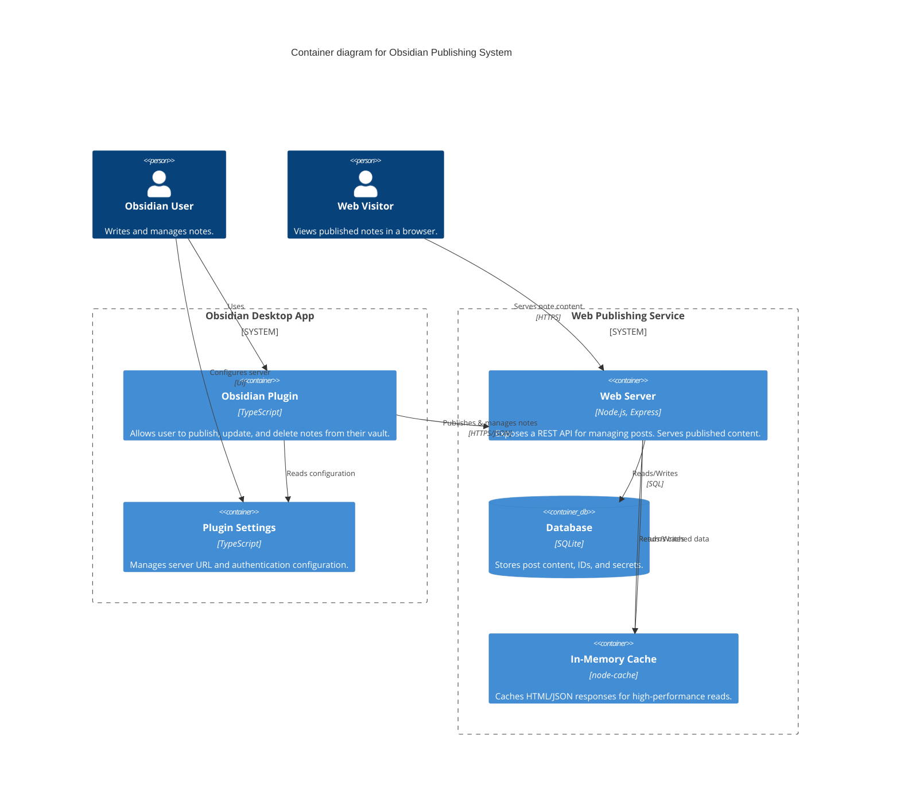
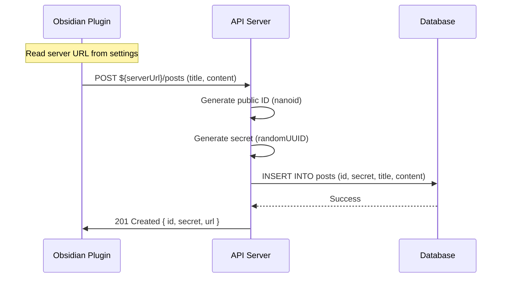
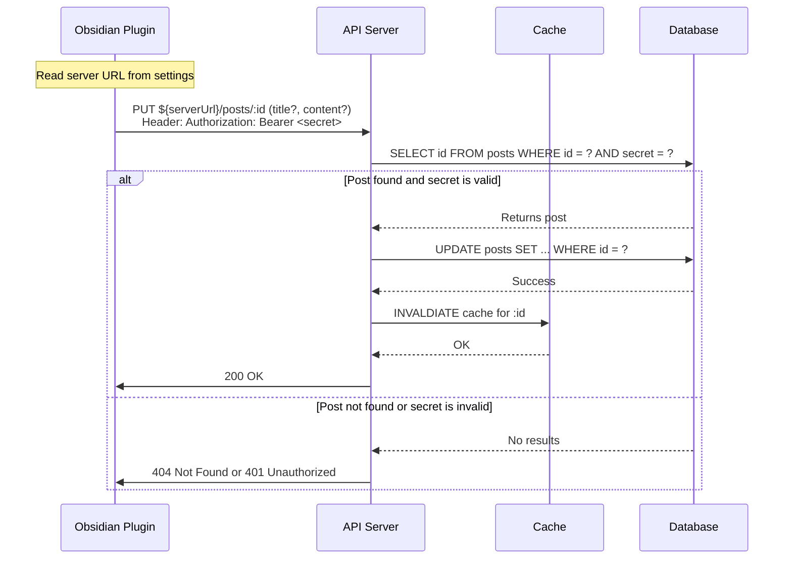
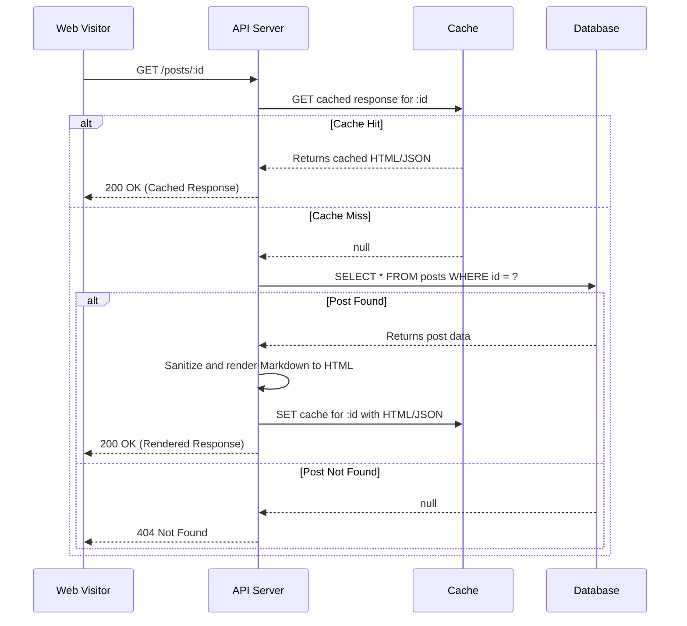
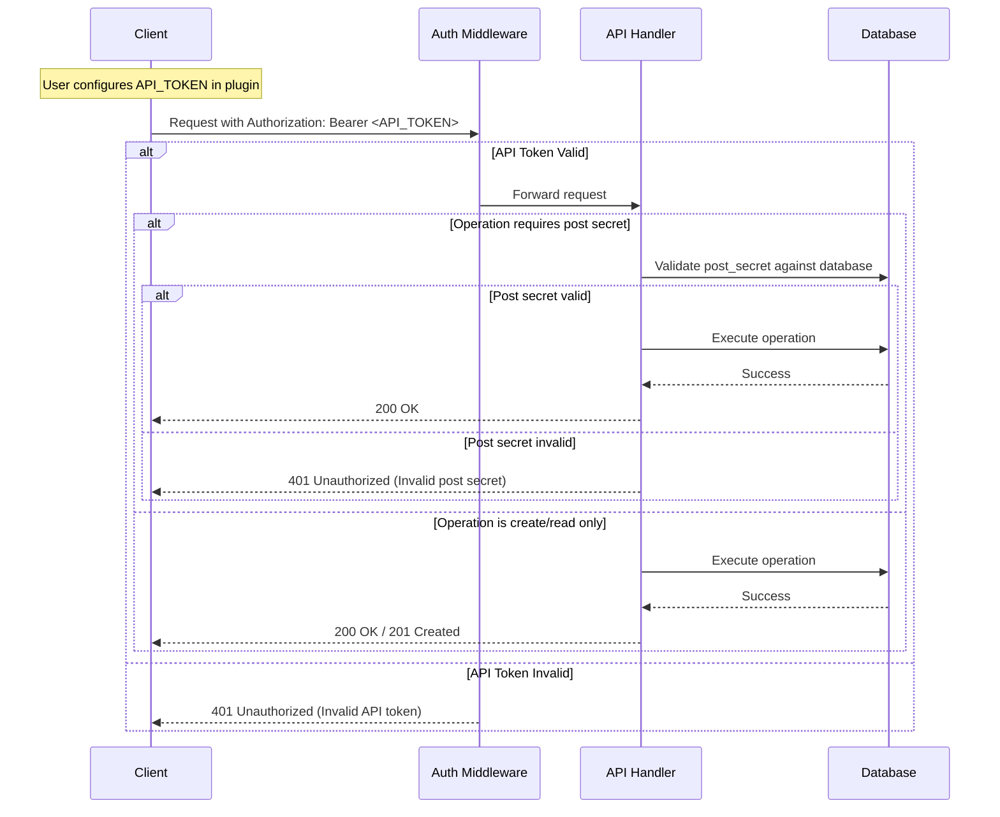

# Obsidian Publishing System - Technical Design

This document outlines the complete technical design for the Obsidian Publishing System, a monorepo project consisting of an Obsidian plugin client and an Express.js web publishing service.

## 1. System Architecture Overview

The system is a client-server application. The **client** is an Obsidian plugin that allows users to publish notes. The **server** is a web service that receives, stores, and serves these notes to be viewed in a web browser.

### 1.1. Monorepo Structure

The project is organized as a monorepo to facilitate code sharing and streamlined development:

```
.
├── client/          # Obsidian plugin (TypeScript, esbuild)
├── server/          # Express.js API server (TypeScript, Docker)
├── shared/          # Shared TypeScript interfaces and types
├── deployment/      # Docker Compose, Nginx config, deployment scripts
└── design.md        # This document
```

### 1.2. C4 Container Diagram

This diagram illustrates the high-level architecture and interactions between the major components of the system.



## 2. Component Design (Shared Types)

A `shared` module contains TypeScript interfaces used by both the client and server to ensure type safety and consistency across the system.

```typescript
// shared/types.ts

/**
 * Represents a published post stored in the database.
 */
export interface Post {
  /**
   * Publicly visible ID, 8 characters long.
   * @example "aBcDeFgH"
   */
  id: string;

  /**
   * Secret key for updating or deleting the post.
   * This is a UUID and is never exposed publicly.
   */
  secret: string;

  /**
   * The raw Markdown content of the note.
   */
  content: string;

  /**
   * The title of the note.
   */
  title: string;

  /**
   * ISO 8601 timestamp of when the post was created.
   * @example "2025-07-30T10:00:00.000Z"
   */
  created_at: string;

  /**
   * ISO 8601 timestamp of when the post was last updated.
   * @example "2025-07-30T10:00:00.000Z"
   */
  updated_at: string;
}

/**
 * API request body for creating a new post.
 */
export interface CreatePostRequest {
  title: string;
  content: string;
}

/**
 * API response after successfully creating a new post.
 */
export interface CreatePostResponse {
  id: Post['id'];
  secret: Post['secret'];
  url: string;
}

/**
 * API request body for updating an existing post.
 */
export interface UpdatePostRequest {
  title?: string;
  content?: string;
}

/**
 * Standardized error response from the API.
 */
export interface ApiErrorResponse {
  error: {
    message: string;
    code?: string; // e.g., 'NOT_FOUND', 'INVALID_SECRET'
  };
}
```

## 3. Data Flow Diagrams

Mermaid sequence diagrams illustrate the primary user workflows.

### 3.1. Create a New Post



### 3.2. Update an Existing Post



### 3.3. View a Published Post



## 4. Database Design

The system uses a single SQLite database file (`server/database/posts.db`) for simplicity and ease of deployment.

### 4.1. Schema (`posts` table)

```sql
CREATE TABLE IF NOT EXISTS posts (
    id TEXT PRIMARY KEY NOT NULL,           -- Public, 8-char nanoid
    secret TEXT NOT NULL UNIQUE,            -- Private, UUID for management
    title TEXT NOT NULL,
    content TEXT NOT NULL,
    created_at TEXT NOT NULL DEFAULT (strftime('%Y-%m-%dT%H:%M:%fZ', 'now')),
    updated_at TEXT NOT NULL DEFAULT (strftime('%Y-%m-%dT%H:%M:%fZ', 'now'))
);
```

### 4.2. ID Generation

-   **Public ID (`id`)**: Generated using `nanoid(8)`. This provides a short, URL-friendly, and collision-resistant identifier for public access.
-   **Secret (`secret`)**: Generated using `crypto.randomUUID()`. This is a cryptographically secure, unguessable token required for any modification or deletion operations.

### 4.3. Triggers

An `updated_at` trigger automatically updates the timestamp on every modification, ensuring data integrity without application-level logic.

```sql
CREATE TRIGGER IF NOT EXISTS set_timestamp_on_update
AFTER UPDATE ON posts
FOR EACH ROW
BEGIN
    UPDATE posts
    SET updated_at = strftime('%Y-%m-%dT%H:%M:%fZ', 'now')
    WHERE id = OLD.id;
END;
```

### 4.4. Indexing Strategy

Indexes are created to ensure fast lookups for common query patterns.

```sql
-- Index for fast public lookups by ID (primary key is already indexed)
-- CREATE UNIQUE INDEX idx_posts_id ON posts(id); -- Not needed for PRIMARY KEY

-- Index for fast lookups by secret (for auth checks)
CREATE UNIQUE INDEX IF NOT EXISTS idx_posts_secret ON posts(secret);
```

## 5. API Design

The REST API follows standard conventions. All responses are JSON unless a specific `Accept` header (e.g., `text/html`) is provided for the `GET` endpoint.

### 5.1. Authentication

The API implements a two-tier authentication system for comprehensive security:

#### 5.1.1. API Token Authentication (Global)

-   **Method**: Bearer Token Authentication for API access control
-   **Header**: `Authorization: Bearer <api_token>`
-   **Configuration**: Server-side environment variable `API_TOKEN`
-   **Scope**: Required for **all API operations** (`POST`, `PUT`, `DELETE`)
-   **Purpose**: Controls who can access the publishing service entirely
-   **Implementation**: Middleware validates the token before processing any request

#### 5.1.2. Post Secret Authentication (Post-specific)

-   **Method**: UUID-based secret for post-specific operations
-   **Header**: `Authorization: Bearer <post_secret>` (for update/delete operations)
-   **Source**: Generated during post creation and returned to client
-   **Scope**: Required for modifying specific posts (`PUT`, `DELETE`)
-   **Purpose**: Ensures only the original author can modify their posts

#### 5.1.3. Authentication Flow



#### 5.1.4. Token Configuration

**Server Configuration** (Environment Variables):
```bash
# Required: Global API access token
API_TOKEN=your-very-secure-api-token-here

# Optional: Token description for documentation
API_TOKEN_DESCRIPTION="Production API access for Obsidian Publishing"
```

**Client Configuration**:
- Users configure the same `API_TOKEN` in the Obsidian plugin settings
- Token is sent with every API request via Authorization header
- Token is stored securely in plugin's data.json file

#### 5.1.5. Security Benefits

-   **Defense in Depth**: Two-layer authentication prevents unauthorized access
-   **Access Control**: API token controls who can use the service
-   **Post Ownership**: Post secrets ensure content ownership integrity
-   **Stateless Design**: No server-side session management required
-   **Standard Compliance**: Uses RFC 6750 Bearer Token specification

### 5.2. Endpoints

#### `POST /posts`

-   **Description**: Creates a new post.
-   **Authentication**: **Required**. `Authorization: Bearer <API_TOKEN>`
-   **Request Body**: `CreatePostRequest`
-   **Response**: `201 Created` with `CreatePostResponse` body.
-   **Errors**: 
    -   `401 Unauthorized` for invalid/missing API token
    -   `400 Bad Request` for validation errors

#### `GET /posts/:id`

-   **Description**: Retrieves a published post (public endpoint).
-   **Authentication**: **Not required** (public read access)
-   **Request Headers**:
    -   `Accept: application/json` (optional): Returns the raw `Post` object (excluding secrets).
    -   `Accept: text/html` (default): Returns the content rendered as an HTML page.
-   **Response**: `200 OK` with HTML or JSON. `404 Not Found` if the ID does not exist.

#### `PUT /posts/:id`

-   **Description**: Updates an existing post's title or content.
-   **Authentication**: **Two-tier required**:
    1. **API Token**: `Authorization: Bearer <API_TOKEN>` (server access)
    2. **Post Secret**: Request body must include `secret: <post_secret>` (post ownership)
-   **Request Body**: `UpdatePostRequest` (including `secret` field)
-   **Response**: `200 OK`. 
-   **Errors**:
    -   `401 Unauthorized` for invalid/missing API token
    -   `401 Unauthorized` for invalid post secret  
    -   `404 Not Found` for invalid post ID
    -   `400 Bad Request` for validation errors

#### `DELETE /posts/:id`

-   **Description**: Deletes a post.
-   **Authentication**: **Two-tier required**:
    1. **API Token**: `Authorization: Bearer <API_TOKEN>` (server access)
    2. **Post Secret**: Request body must include `secret: <post_secret>` (post ownership)
-   **Request Body**: `{ "secret": "<post_secret>" }`
-   **Response**: `204 No Content`.
-   **Errors**:
    -   `401 Unauthorized` for invalid/missing API token
    -   `401 Unauthorized` for invalid post secret
    -   `404 Not Found` for invalid post ID

#### `GET /health`

-   **Description**: Health check endpoint for monitoring.
-   **Response**: `200 OK` with `{ "status": "ok", "timestamp": "..." }`.

## 6. Security Architecture

### 6.1. API Token Security

#### 6.1.1. Token Generation Best Practices

-   **Strength Requirements**: Minimum 32 characters, cryptographically secure
-   **Generation Methods**:
    ```bash
    # Recommended: OpenSSL (base64 encoded)
    openssl rand -base64 32
    
    # Alternative: Node.js crypto module
    node -e "console.log(require('crypto').randomBytes(32).toString('base64'))"
    
    # Alternative: Linux/Unix (hexadecimal)
    openssl rand -hex 32
    ```
-   **Character Sets**: Use alphanumeric with special characters for maximum entropy
-   **Uniqueness**: Generate unique tokens for each deployment environment

#### 6.1.2. Token Storage and Distribution

**Server-Side Storage**:
-   Store in environment variables, never in code or configuration files
-   Use container orchestration secrets (Docker Secrets, Kubernetes Secrets)
-   Implement proper secret rotation procedures

**Client-Side Configuration**:
-   Users receive tokens through secure channels (encrypted email, password managers)
-   Tokens stored in Obsidian plugin's private data.json (encrypted by Obsidian)
-   Clear documentation on token security requirements

#### 6.1.3. Token Lifecycle Management

**Deployment Phases**:
-   **Development**: Use separate tokens, can be less stringent
-   **Staging**: Production-strength tokens, separate from production
-   **Production**: Maximum security tokens, regularly rotated

**Rotation Strategy**:
-   Plan for token rotation without service interruption
-   Maintain backward compatibility during transition periods
-   Document rotation procedures for administrators

#### 6.1.4. Security Monitoring

**Token Usage Logging**:
```typescript
// Example logging structure
logger.info('API access attempt', {
  timestamp: new Date().toISOString(),
  clientIP: req.ip,
  userAgent: req.get('User-Agent'),
  endpoint: req.path,
  method: req.method,
  tokenValid: true, // Never log actual token
  authResult: 'success'
});
```

**Anomaly Detection**:
-   Monitor for unusual API usage patterns
-   Rate limiting per token/IP combination
-   Alert on repeated authentication failures

### 6.2. Content Sanitization

-   **Strategy**: Sanitize on render, not on ingress.
-   **Tool**: `DOMPurify` on the server.
-   **Timing**: When a request for `text/html` is received (`GET /posts/:id`), the raw Markdown is retrieved from the database, converted to HTML, and *then* sanitized with `DOMPurify` before being sent in the response.
-   **Rationale**: Storing raw Markdown preserves the user's original content perfectly. This allows for future rendering options (e.g., to PDF, different Markdown flavors) and prevents data corruption. Sanitizing at render time ensures that any content served to a browser is safe from XSS attacks.

### 6.2. Rate Limiting

-   **Tool**: `express-rate-limit` middleware with token-aware configuration.
-   **Strategy**: Multi-tier rate limiting based on authentication status and endpoint type
-   **Configuration**: 
    ```typescript
    // Example configuration in server/src/app.ts
    import rateLimit from 'express-rate-limit';

    // Strict limits for unauthenticated requests
    const publicLimiter = rateLimit({
        windowMs: 15 * 60 * 1000, // 15 minutes
        max: 50, // Limit public requests
        message: 'Too many requests from this IP',
        standardHeaders: true,
        legacyHeaders: false,
    });

    // More generous limits for authenticated API requests
    const apiLimiter = rateLimit({
        windowMs: 15 * 60 * 1000, // 15 minutes
        max: 200, // Higher limit for valid API tokens
        skip: (req) => !req.headers.authorization, // Only apply to authenticated requests
        keyGenerator: (req) => {
            // Rate limit per token rather than just IP
            const token = req.headers.authorization?.split(' ')[1];
            return `api_${token ? crypto.createHash('sha256').update(token).digest('hex').substring(0, 8) : req.ip}`;
        },
        standardHeaders: true,
        legacyHeaders: false,
    });

    // Apply public limits to read endpoints
    app.use('/posts/:id', publicLimiter);
    
    // Apply API limits to write endpoints  
    app.use(['/posts'], apiLimiter);
    ```

### 6.3. CORS (Cross-Origin Resource Sharing)

The server is configured to accept requests from the Obsidian application protocol while supporting custom server deployments.

```typescript
// Example configuration in server/src/app.ts
import cors from 'cors';

const corsOptions = {
  origin: [
    'app://obsidian.md', // Official desktop app
    /^capacitor:\/\/localhost/, // Mobile
    /^http:\/\/localhost/, // Development
    'https://share.141029.xyz' // Default production server
    // Note: Custom deployments will need to add their domain here
  ],
  methods: ['GET', 'POST', 'PUT', 'DELETE', 'OPTIONS'],
  allowedHeaders: ['Content-Type', 'Authorization'],
};

app.use(cors(corsOptions));
```

#### 6.3.1. Dynamic CORS for Custom Deployments

Since users can configure custom server URLs through the plugin settings, each server deployment must be configured with appropriate CORS origins:

-   **Standard Configuration**: All servers must allow `app://obsidian.md` for the official Obsidian desktop application
-   **Custom Domain Support**: When deploying to custom domains, administrators must update the CORS configuration to include their domain
-   **Development Flexibility**: Localhost origins are permitted for development and testing environments
-   **Security Boundary**: CORS configuration acts as the first line of defense, ensuring only authorized origins can access the API

## 7. Deployment Architecture

The server is designed for containerized deployment using Docker and Docker Compose, with environment-based configuration for security and flexibility.

### 7.1. Environment Configuration

The application uses environment variables for secure configuration management:

#### 7.1.1. Required Environment Variables

```bash
# .env file example
# API Authentication
API_TOKEN=your-very-secure-api-token-here-minimum-32-characters

# Application Configuration  
NODE_ENV=production
PORT=3000
DB_PATH=/app/data/posts.db

# CORS Configuration
CORS_ORIGIN=https://your-domain.com

# SSL Configuration (for deployment)
DOMAIN=your-domain.com
SSL_EMAIL=your-email@example.com

# Optional: API Token Description
API_TOKEN_DESCRIPTION="Production API access for Obsidian Publishing"
```

#### 7.1.2. Security Considerations

-   **API_TOKEN**: Must be cryptographically strong (recommend 32+ characters)
-   **Token Generation**: Use `openssl rand -base64 32` or similar secure methods
-   **Environment Isolation**: Different tokens for development, staging, and production
-   **Secret Management**: Never commit `.env` files to version control

### 7.2. Docker Compose Setup

A `docker-compose.yml` file orchestrates the services with environment variable support:

```yaml
# docker-compose.yml
version: '3.8'

services:
  app:
    image: candy0327/obsidian-publisher-server:${VERSION:-latest}
    container_name: obsidian-publisher-app
    restart: unless-stopped
    volumes:
      - ../server/database:/usr/src/app/database
    environment:
      - NODE_ENV=${NODE_ENV:-production}
      - PORT=${PORT:-3000}
      - DB_PATH=${DB_PATH:-/app/data/posts.db}
      - API_TOKEN=${API_TOKEN}
      - CORS_ORIGIN=${CORS_ORIGIN}
      - API_TOKEN_DESCRIPTION=${API_TOKEN_DESCRIPTION}
    expose:
      - '3000'

  nginx:
    image: nginx:latest
    container_name: obsius-nginx
    restart: unless-stopped
    ports:
      - '80:80'
      - '443:443'
    volumes:
      - ./nginx.conf:/etc/nginx/nginx.conf:ro
      - ./certbot/conf:/etc/letsencrypt
      - ./certbot/www:/var/www/certbot
    depends_on:
      - app

  certbot:
    image: certbot/certbot
    container_name: obsius-certbot
    volumes:
      - ./certbot/conf:/etc/letsencrypt
      - ./certbot/www:/var/www/certbot
    command: certonly --webroot --webroot-path=/var/www/certbot --email your-email@example.com -d your-domain.com --agree-tos --no-eff-email -n
```

### 7.2. Nginx Configuration

Nginx acts as a reverse proxy, handles SSL termination, and is configured to allow large post sizes.

```nginx
# deployment/nginx.conf
events {}

http {
    server {
        listen 80;
        server_name your-domain.com;

        location /.well-known/acme-challenge/ {
            root /var/www/certbot;
        }

        location / {
            return 301 https://$host$request_uri;
        }
    }

    server {
        listen 443 ssl;
        server_name your-domain.com;

        ssl_certificate /etc/letsencrypt/live/your-domain.com/fullchain.pem;
        ssl_certificate_key /etc/letsencrypt/live/your-domain.com/privkey.pem;

        # Critical for allowing large notes to be published
        client_max_body_size 50m;

        location / {
            proxy_pass http://app:3000;
            proxy_set_header Host $host;
            proxy_set_header X-Real-IP $remote_addr;
            proxy_set_header X-Forwarded-For $proxy_add_x_forwarded_for;
            proxy_set_header X-Forwarded-Proto $scheme;
        }
    }
}
```
**Note**: `client_max_body_size 50m;` is crucial to prevent Nginx from rejecting large requests from the Obsidian plugin with a `413 Payload Too Large` error.

## 8. Plugin Settings Architecture

The Obsidian plugin implements a comprehensive settings system to support custom server deployments and authentication.

### 8.1. Settings Data Model

The plugin uses an extended data structure to store both posts and configuration:

```typescript
interface PluginSettings {
  serverUrl: string;          // Custom server URL
  authToken?: string;         // Optional authentication token for private servers
}

interface PluginData {
  posts: Record<string, Post>;
  settings?: PluginSettings;
}
```

### 8.2. Settings UI Design

The settings tab (`ObsiusSettingTab`) provides a user-friendly interface with the following components:

-   **Server URL Input**: Required field with real-time HTTPS validation and format checking
-   **Authentication Token**: Optional field for private server deployments with proper masking
-   **Connection Test Button**: Validates server connectivity by testing the `/health` endpoint
-   **Reset to Default**: Restores the original production server settings
-   **Status Indicators**: Visual feedback showing connection status and configuration validity

### 8.3. Configuration Flow

The settings management follows this lifecycle:

1. **First Installation**: Plugin defaults to the production server URL (`https://share.141029.xyz`)
2. **Settings Persistence**: All configuration is stored using Obsidian's `saveData`/`loadData` API in the plugin's `data.json`
3. **Dynamic Resolution**: Server URL is resolved dynamically for every API call, removing hardcoded dependencies
4. **Backward Compatibility**: Existing published posts continue to work seamlessly when server settings change

### 8.4. URL Validation Rules

The settings system enforces strict validation to ensure security and functionality:

-   **Protocol Enforcement**: Must use HTTPS protocol (except `localhost` and `127.0.0.1` for development)
-   **Format Validation**: Standard URL format validation with proper scheme, host, and optional port
-   **Connection Testing**: Live validation against the server's `/health` endpoint before saving
-   **Security Prevention**: Blocks malformed URLs, JavaScript URIs, and other dangerous inputs

### 8.5. Configuration Management Best Practices

#### Security Considerations

-   **Secure Storage**: Server URLs and authentication tokens are stored securely in the plugin's private data
-   **HTTPS Enforcement**: Production deployments must use valid SSL certificates
-   **Token Protection**: Authentication tokens are masked in the UI and never logged

#### Development Support

-   **Local Development**: `localhost` and `127.0.0.1` URLs are permitted for development testing
-   **Status Feedback**: Real-time UI feedback shows current configuration and connection status
-   **Easy Switching**: Developers can quickly switch between local and production server instances

#### Migration and Backup

-   **Seamless Upgrades**: Existing installations automatically inherit the default server URL
-   **Data Preservation**: All published posts remain accessible when changing server configurations
-   **Settings Export**: Configuration can be exported for backup or sharing across installations

## 9. Caching Strategy

-   **Tool**: `node-cache` library on the server.
-   **Strategy**: Cache successful `GET /posts/:id` responses to reduce database load and improve response times for frequently accessed notes.
-   **Cache Key**: The post's public `id`.
-   **Cache Content**: The final rendered HTML or the raw JSON object.
-   **Invalidation**: The cache for a specific `id` is programmatically invalidated (`del`) whenever a `PUT` or `DELETE` request for that same `id` is successfully processed. This ensures that viewers always see the most up-to-date content.

## 10. Testing Strategy

### 10.1. Client (Obsidian Plugin)

-   **Framework**: Jest with `jest-environment-obsidian`.
-   **Approach**: This environment provides a mocked Obsidian API, but to improve testability, we will create our own modular mocks for specific Obsidian API surfaces (`Vault`, `Notice`, `PluginSettingTab`, etc.).
-   **Benefits**: This allows for true unit testing of plugin logic (e.g., API client, UI components) in isolation from the full Obsidian environment, leading to faster and more reliable tests.

### 10.2. Server (Express.js API)

-   **Framework**: Jest and `supertest`.
-   **Approach**: Continue with the existing strategy of writing integration tests that make real HTTP requests to the API endpoints. These tests will cover the full request/response cycle, including database interactions, authentication logic, and error handling. An in-memory SQLite database will be used for test runs to ensure isolation.

## 11. Error Handling

A standardized approach to error handling provides a consistent experience for the user and simplifies client-side logic.

### 11.1. Standardized Error Response

All API errors will return a JSON object with a consistent shape:

```json
{
  "error": {
    "message": "The secret provided is invalid or does not have permission.",
    "code": "INVALID_SECRET"
  }
}
```

### 11.2. End-to-End Flow Example

1.  **Action**: User tries to update a post with an incorrect secret.
2.  **Client**: Plugin sends `PUT /posts/aBcDeFgH` with `Authorization: Bearer <wrong-secret>`.
3.  **Server**: The API checks the database, fails to find a match for the ID and secret, and responds with `401 Unauthorized` and the `ApiErrorResponse` body.
4.  **Client**: The plugin's HTTP client catches the non-2xx response, parses the JSON body, and uses the `message` to create a user-facing notification within Obsidian using `new Notice('Error updating post: The secret provided is invalid...')`.

## 12. Performance & Monitoring

### 12.1. Performance Considerations

-   **Caching**: The `node-cache` strategy is the primary performance enhancement for read operations.
-   **Database Indexing**: Proper indexing on `id` and `secret` columns ensures that database lookups remain fast as the number of posts grows.
-   **Payload Size**: `client_max_body_size` in Nginx prevents request failures for large notes. The client should also be mindful of sending excessively large payloads.

### 12.2. Monitoring

-   **Health Endpoint**: The `GET /health` endpoint provides a simple, lightweight way for uptime monitoring tools (like Uptime Kuma, Pingdom) to check if the service is running.
-   **Logging**: The application will use a structured logger (e.g., `pino`) to log requests, errors, and key application events. These logs can be monitored via `docker-compose logs -f`.
-   **System Metrics**: Basic server health (CPU, memory) can be monitored using `docker stats`.