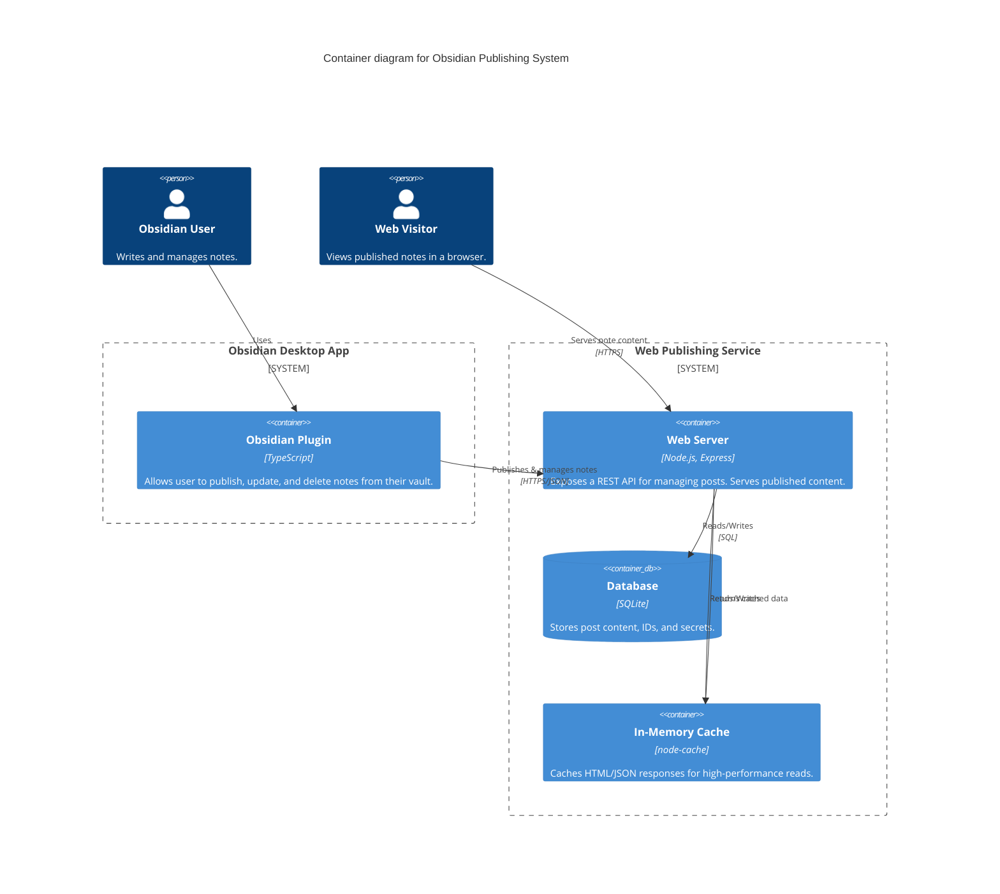
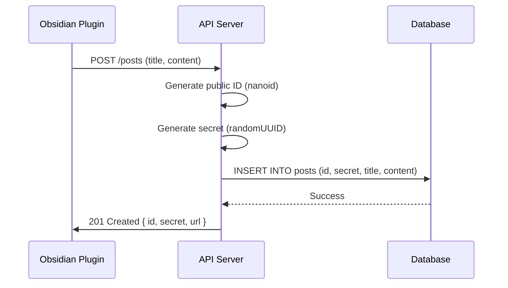
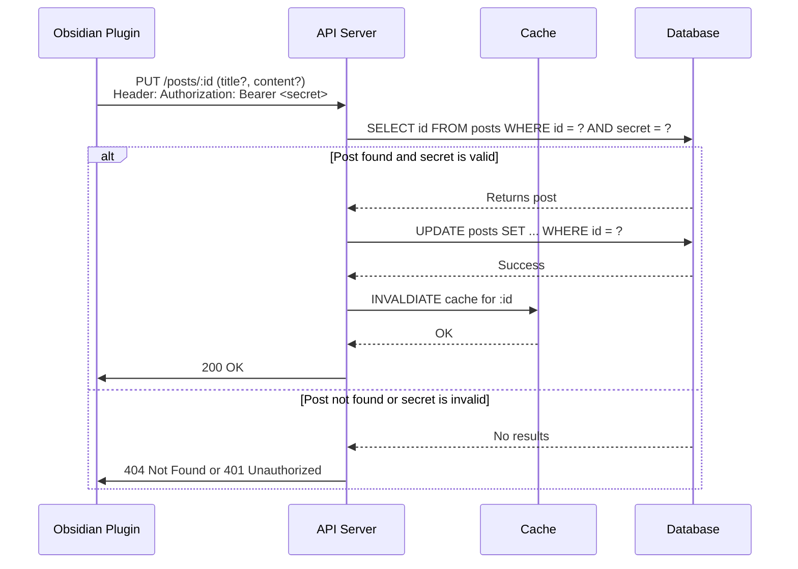
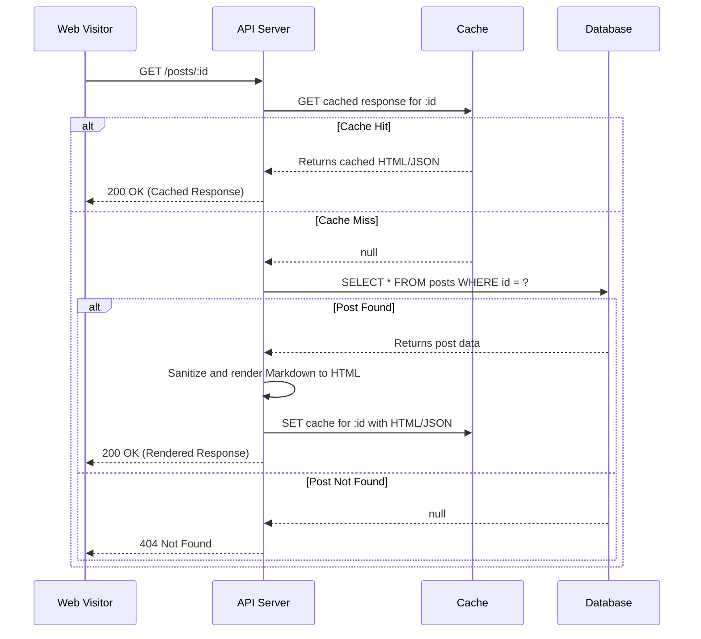

# Obsidian Publishing System - Technical Design

This document outlines the complete technical design for the Obsidian Publishing System, a monorepo project consisting of an Obsidian plugin client and an Express.js web publishing service.

## 1. System Architecture Overview

The system is a client-server application. The **client** is an Obsidian plugin that allows users to publish notes. The **server** is a web service that receives, stores, and serves these notes to be viewed in a web browser.

### 1.1. Monorepo Structure

The project is organized as a monorepo to facilitate code sharing and streamlined development:

```
.
├── client/          # Obsidian plugin (TypeScript, esbuild)
├── server/          # Express.js API server (TypeScript, Docker)
├── shared/          # Shared TypeScript interfaces and types
├── deployment/      # Docker Compose, Nginx config, deployment scripts
└── design.md        # This document
```

### 1.2. C4 Container Diagram

This diagram illustrates the high-level architecture and interactions between the major components of the system.



## 2. Component Design (Shared Types)

A `shared` module contains TypeScript interfaces used by both the client and server to ensure type safety and consistency across the system.

```typescript
// shared/types.ts

/**
 * Represents a published post stored in the database.
 */
export interface Post {
  /**
   * Publicly visible ID, 8 characters long.
   * @example "aBcDeFgH"
   */
  id: string;

  /**
   * Secret key for updating or deleting the post.
   * This is a UUID and is never exposed publicly.
   */
  secret: string;

  /**
   * The raw Markdown content of the note.
   */
  content: string;

  /**
   * The title of the note.
   */
  title: string;

  /**
   * ISO 8601 timestamp of when the post was created.
   * @example "2025-07-30T10:00:00.000Z"
   */
  created_at: string;

  /**
   * ISO 8601 timestamp of when the post was last updated.
   * @example "2025-07-30T10:00:00.000Z"
   */
  updated_at: string;
}

/**
 * API request body for creating a new post.
 */
export interface CreatePostRequest {
  title: string;
  content: string;
}

/**
 * API response after successfully creating a new post.
 */
export interface CreatePostResponse {
  id: Post['id'];
  secret: Post['secret'];
  url: string;
}

/**
 * API request body for updating an existing post.
 */
export interface UpdatePostRequest {
  title?: string;
  content?: string;
}

/**
 * Standardized error response from the API.
 */
export interface ApiErrorResponse {
  error: {
    message: string;
    code?: string; // e.g., 'NOT_FOUND', 'INVALID_SECRET'
  };
}
```

## 3. Data Flow Diagrams

Mermaid sequence diagrams illustrate the primary user workflows.

### 3.1. Create a New Post



### 3.2. Update an Existing Post



### 3.3. View a Published Post



## 4. Database Design

The system uses a single SQLite database file (`server/database/posts.db`) for simplicity and ease of deployment.

### 4.1. Schema (`posts` table)

```sql
CREATE TABLE IF NOT EXISTS posts (
    id TEXT PRIMARY KEY NOT NULL,           -- Public, 8-char nanoid
    secret TEXT NOT NULL UNIQUE,            -- Private, UUID for management
    title TEXT NOT NULL,
    content TEXT NOT NULL,
    created_at TEXT NOT NULL DEFAULT (strftime('%Y-%m-%dT%H:%M:%fZ', 'now')),
    updated_at TEXT NOT NULL DEFAULT (strftime('%Y-%m-%dT%H:%M:%fZ', 'now'))
);
```

### 4.2. ID Generation

-   **Public ID (`id`)**: Generated using `nanoid(8)`. This provides a short, URL-friendly, and collision-resistant identifier for public access.
-   **Secret (`secret`)**: Generated using `crypto.randomUUID()`. This is a cryptographically secure, unguessable token required for any modification or deletion operations.

### 4.3. Triggers

An `updated_at` trigger automatically updates the timestamp on every modification, ensuring data integrity without application-level logic.

```sql
CREATE TRIGGER IF NOT EXISTS set_timestamp_on_update
AFTER UPDATE ON posts
FOR EACH ROW
BEGIN
    UPDATE posts
    SET updated_at = strftime('%Y-%m-%dT%H:%M:%fZ', 'now')
    WHERE id = OLD.id;
END;
```

### 4.4. Indexing Strategy

Indexes are created to ensure fast lookups for common query patterns.

```sql
-- Index for fast public lookups by ID (primary key is already indexed)
-- CREATE UNIQUE INDEX idx_posts_id ON posts(id); -- Not needed for PRIMARY KEY

-- Index for fast lookups by secret (for auth checks)
CREATE UNIQUE INDEX IF NOT EXISTS idx_posts_secret ON posts(secret);
```

## 5. API Design

The REST API follows standard conventions. All responses are JSON unless a specific `Accept` header (e.g., `text/html`) is provided for the `GET` endpoint.

### 5.1. Authentication

-   **Method**: Bearer Token Authentication.
-   **Header**: `Authorization: Bearer <secret>`
-   **Rationale**: This method is simple, stateless, and well-suited for a machine-to-machine API like the one used by the Obsidian plugin. The secret is passed in a standard header, keeping it out of URLs and request bodies. It is required for all state-changing operations (`PUT`, `DELETE`).

### 5.2. Endpoints

#### `POST /posts`

-   **Description**: Creates a new post.
-   **Request Body**: `CreatePostRequest`
-   **Response**: `201 Created` with `CreatePostResponse` body.

#### `GET /posts/:id`

-   **Description**: Retrieves a published post.
-   **Request Headers**:
    -   `Accept: application/json` (optional): Returns the raw `Post` object (excluding the secret).
    -   `Accept: text/html` (default): Returns the content rendered as an HTML page.
-   **Response**: `200 OK` with HTML or JSON. `404 Not Found` if the ID does not exist.

#### `PUT /posts/:id`

-   **Description**: Updates an existing post's title or content.
-   **Authentication**: **Required**. `Authorization: Bearer <secret>`
-   **Request Body**: `UpdatePostRequest`
-   **Response**: `200 OK`. `401 Unauthorized` for invalid secret. `404 Not Found` for invalid ID.

#### `DELETE /posts/:id`

-   **Description**: Deletes a post.
-   **Authentication**: **Required**. `Authorization: Bearer <secret>`
-   **Response**: `204 No Content`. `401 Unauthorized` for invalid secret. `404 Not Found` for invalid ID.

#### `GET /health`

-   **Description**: Health check endpoint for monitoring.
-   **Response**: `200 OK` with `{ "status": "ok", "timestamp": "..." }`.

## 6. Security Architecture

### 6.1. Content Sanitization

-   **Strategy**: Sanitize on render, not on ingress.
-   **Tool**: `DOMPurify` on the server.
-   **Timing**: When a request for `text/html` is received (`GET /posts/:id`), the raw Markdown is retrieved from the database, converted to HTML, and *then* sanitized with `DOMPurify` before being sent in the response.
-   **Rationale**: Storing raw Markdown preserves the user's original content perfectly. This allows for future rendering options (e.g., to PDF, different Markdown flavors) and prevents data corruption. Sanitizing at render time ensures that any content served to a browser is safe from XSS attacks.

### 6.2. Rate Limiting

-   **Tool**: `express-rate-limit` middleware.
-   **Configuration**: Apply rate limiting to all API endpoints, with stricter limits on creation (`POST`) and modification (`PUT`, `DELETE`) endpoints to prevent abuse.
    ```typescript
    // Example configuration in server/src/app.ts
    import rateLimit from 'express-rate-limit';

    const apiLimiter = rateLimit({
        windowMs: 15 * 60 * 1000, // 15 minutes
        max: 100, // Limit each IP to 100 requests per window
        standardHeaders: true,
        legacyHeaders: false,
    });

    app.use('/posts', apiLimiter);
    ```

### 6.3. CORS (Cross-Origin Resource Sharing)

The server will be configured to accept requests specifically from the Obsidian application protocol to allow the plugin to function.

```typescript
// Example configuration in server/src/app.ts
import cors from 'cors';

const corsOptions = {
  origin: [
    'app://obsidian.md', // Official desktop app
    /^capacitor:\/\/localhost/, // Mobile
    /^http:\/\/localhost/, // Development
    'https://your-domain.com' // The public domain of the service
  ],
  methods: ['GET', 'POST', 'PUT', 'DELETE', 'OPTIONS'],
  allowedHeaders: ['Content-Type', 'Authorization'],
};

app.use(cors(corsOptions));
```

## 7. Deployment Architecture

The server is designed for containerized deployment using Docker and Docker Compose.

### 7.1. Docker Compose Setup

A `docker-compose.yml` file orchestrates the services.

```yaml
# deployment/docker-compose.yml
version: '3.8'

services:
  app:
    build: ../server
    container_name: obsius-app
    restart: unless-stopped
    volumes:
      - ../server/database:/usr/src/app/database
    environment:
      - NODE_ENV=production
    expose:
      - '3000'

  nginx:
    image: nginx:latest
    container_name: obsius-nginx
    restart: unless-stopped
    ports:
      - '80:80'
      - '443:443'
    volumes:
      - ./nginx.conf:/etc/nginx/nginx.conf:ro
      - ./certbot/conf:/etc/letsencrypt
      - ./certbot/www:/var/www/certbot
    depends_on:
      - app

  certbot:
    image: certbot/certbot
    container_name: obsius-certbot
    volumes:
      - ./certbot/conf:/etc/letsencrypt
      - ./certbot/www:/var/www/certbot
    command: certonly --webroot --webroot-path=/var/www/certbot --email your-email@example.com -d your-domain.com --agree-tos --no-eff-email -n
```

### 7.2. Nginx Configuration

Nginx acts as a reverse proxy, handles SSL termination, and is configured to allow large post sizes.

```nginx
# deployment/nginx.conf
events {}

http {
    server {
        listen 80;
        server_name your-domain.com;

        location /.well-known/acme-challenge/ {
            root /var/www/certbot;
        }

        location / {
            return 301 https://$host$request_uri;
        }
    }

    server {
        listen 443 ssl;
        server_name your-domain.com;

        ssl_certificate /etc/letsencrypt/live/your-domain.com/fullchain.pem;
        ssl_certificate_key /etc/letsencrypt/live/your-domain.com/privkey.pem;

        # Critical for allowing large notes to be published
        client_max_body_size 50m;

        location / {
            proxy_pass http://app:3000;
            proxy_set_header Host $host;
            proxy_set_header X-Real-IP $remote_addr;
            proxy_set_header X-Forwarded-For $proxy_add_x_forwarded_for;
            proxy_set_header X-Forwarded-Proto $scheme;
        }
    }
}
```
**Note**: `client_max_body_size 50m;` is crucial to prevent Nginx from rejecting large requests from the Obsidian plugin with a `413 Payload Too Large` error.

## 8. Plugin Settings Tab

To avoid hardcoding the server URL, the Obsidian plugin will feature a settings tab.

-   **Functionality**: Provides an input field for the user to enter their self-hosted server's base URL (e.g., `https://notes.my-domain.com`).
-   **Storage**: The URL will be saved using Obsidian's `saveData` and `loadData` plugin API methods.
-   **Default**: A default value can be provided, but the user must be able to override it.
-   **Impact**: This makes the plugin portable and usable by anyone who deploys their own instance of the server, a critical feature for a self-hosted solution.

## 9. Caching Strategy

-   **Tool**: `node-cache` library on the server.
-   **Strategy**: Cache successful `GET /posts/:id` responses to reduce database load and improve response times for frequently accessed notes.
-   **Cache Key**: The post's public `id`.
-   **Cache Content**: The final rendered HTML or the raw JSON object.
-   **Invalidation**: The cache for a specific `id` is programmatically invalidated (`del`) whenever a `PUT` or `DELETE` request for that same `id` is successfully processed. This ensures that viewers always see the most up-to-date content.

## 10. Testing Strategy

### 10.1. Client (Obsidian Plugin)

-   **Framework**: Jest with `jest-environment-obsidian`.
-   **Approach**: This environment provides a mocked Obsidian API, but to improve testability, we will create our own modular mocks for specific Obsidian API surfaces (`Vault`, `Notice`, `PluginSettingTab`, etc.).
-   **Benefits**: This allows for true unit testing of plugin logic (e.g., API client, UI components) in isolation from the full Obsidian environment, leading to faster and more reliable tests.

### 10.2. Server (Express.js API)

-   **Framework**: Jest and `supertest`.
-   **Approach**: Continue with the existing strategy of writing integration tests that make real HTTP requests to the API endpoints. These tests will cover the full request/response cycle, including database interactions, authentication logic, and error handling. An in-memory SQLite database will be used for test runs to ensure isolation.

## 11. Error Handling

A standardized approach to error handling provides a consistent experience for the user and simplifies client-side logic.

### 11.1. Standardized Error Response

All API errors will return a JSON object with a consistent shape:

```json
{
  "error": {
    "message": "The secret provided is invalid or does not have permission.",
    "code": "INVALID_SECRET"
  }
}
```

### 11.2. End-to-End Flow Example

1.  **Action**: User tries to update a post with an incorrect secret.
2.  **Client**: Plugin sends `PUT /posts/aBcDeFgH` with `Authorization: Bearer <wrong-secret>`.
3.  **Server**: The API checks the database, fails to find a match for the ID and secret, and responds with `401 Unauthorized` and the `ApiErrorResponse` body.
4.  **Client**: The plugin's HTTP client catches the non-2xx response, parses the JSON body, and uses the `message` to create a user-facing notification within Obsidian using `new Notice('Error updating post: The secret provided is invalid...')`.

## 12. Performance & Monitoring

### 12.1. Performance Considerations

-   **Caching**: The `node-cache` strategy is the primary performance enhancement for read operations.
-   **Database Indexing**: Proper indexing on `id` and `secret` columns ensures that database lookups remain fast as the number of posts grows.
-   **Payload Size**: `client_max_body_size` in Nginx prevents request failures for large notes. The client should also be mindful of sending excessively large payloads.

### 12.2. Monitoring

-   **Health Endpoint**: The `GET /health` endpoint provides a simple, lightweight way for uptime monitoring tools (like Uptime Kuma, Pingdom) to check if the service is running.
-   **Logging**: The application will use a structured logger (e.g., `pino`) to log requests, errors, and key application events. These logs can be monitored via `docker-compose logs -f`.
-   **System Metrics**: Basic server health (CPU, memory) can be monitored using `docker stats`.