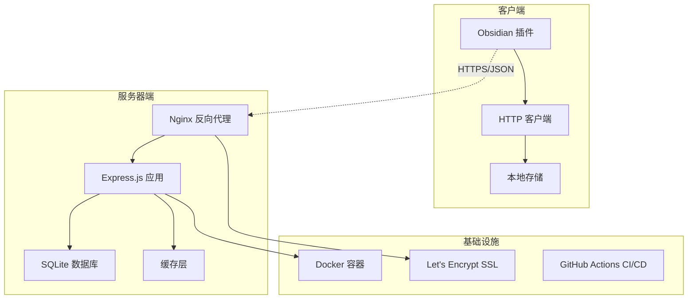
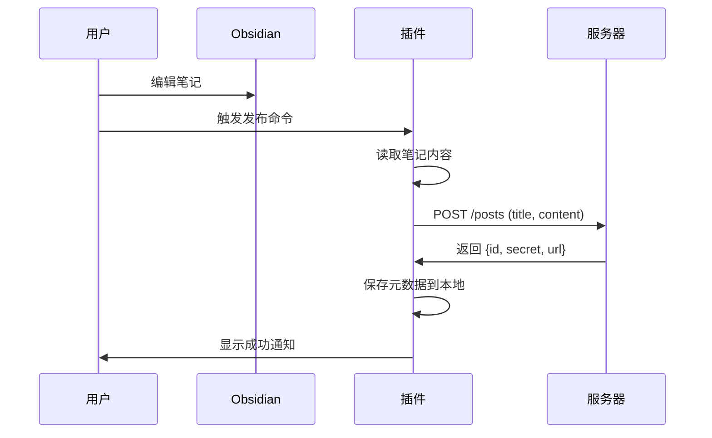
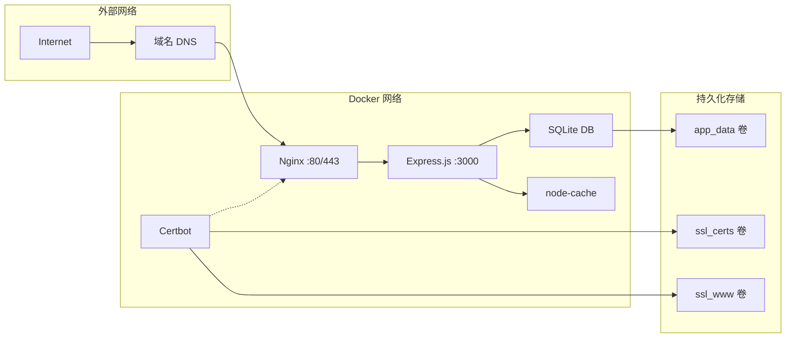
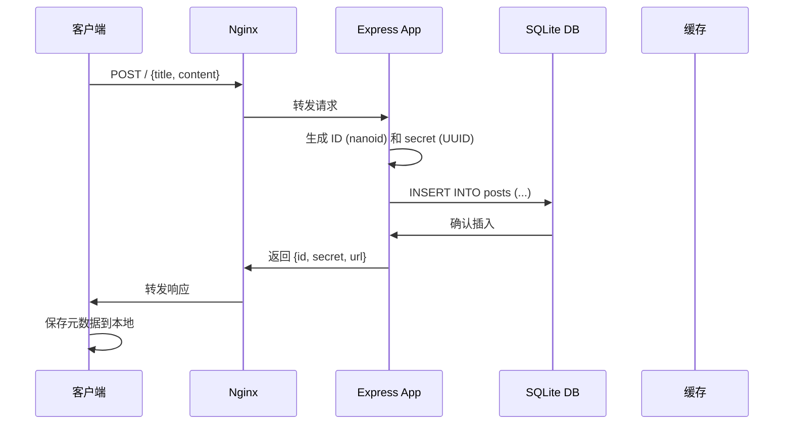
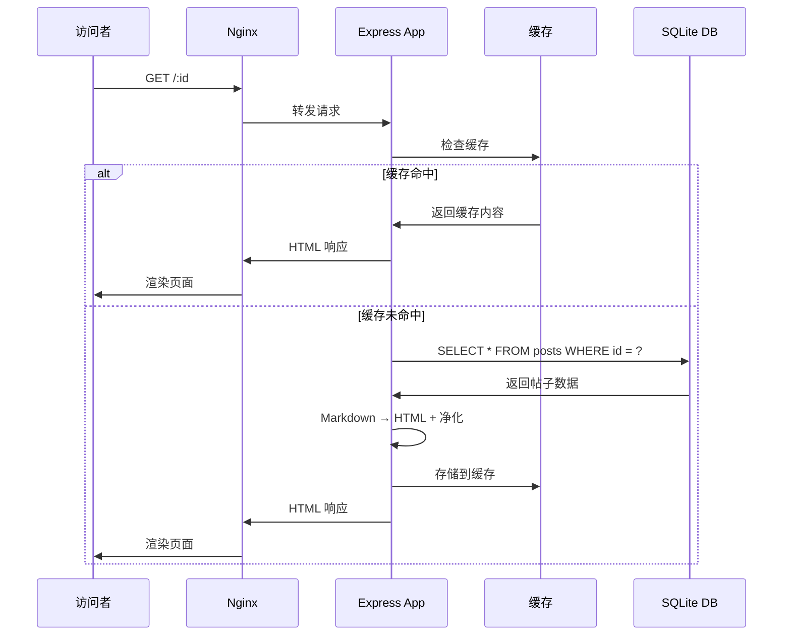
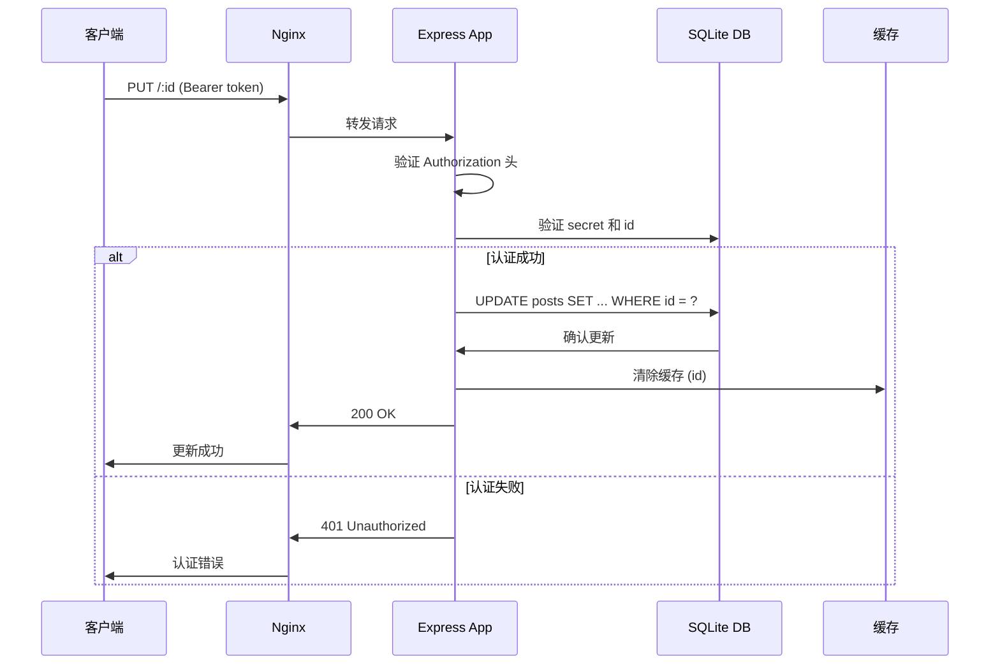
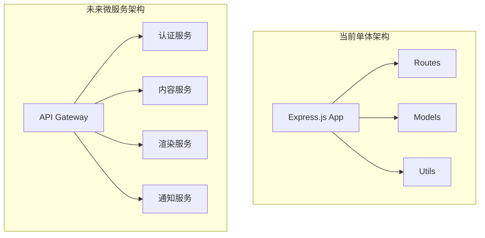

# 系统架构

本文档详细描述了 Obsidian Publishing System 的系统架构、组件设计和数据流程。

## 📋 总体架构

Obsidian Publishing System 采用经典的客户端-服务器架构，专为 Obsidian 笔记发布而设计。



## 🏗️ 组件架构

### 单体仓库结构

该项目采用单体仓库（Monorepo）架构，包含以下主要目录：

```
├── client/          # Obsidian 插件
│   ├── src/
│   │   ├── obsius.ts      # 核心 API 客户端
│   │   ├── http.ts        # HTTP 包装器
│   │   └── modals.ts      # UI 组件
│   ├── main.ts            # 插件入口点
│   └── manifest.json      # 插件清单
├── server/          # Express.js 服务器
│   ├── src/
│   │   ├── app.ts         # 应用程序主入口
│   │   ├── routes/        # API 路由
│   │   ├── models/        # 数据模型
│   │   ├── utils/         # 工具函数
│   │   └── middleware/    # 中间件
│   └── Dockerfile         # 容器配置
├── shared/          # 共享类型定义
│   └── types.ts           # TypeScript 接口
└── deployment/      # 部署配置
    ├── docker-compose.yml # 容器编排
    └── deploy.sh          # 部署脚本
```

## 🖥️ 客户端架构

### Obsidian 插件组件

```typescript
// 核心组件架构
class ObsiusPlugin extends Plugin {
    settings: PluginData;
    apiClient: ObsiusClient;
    
    // 插件生命周期
    async onload() {
        // 加载设置和初始化客户端
        // 注册命令和 UI 元素
    }
}
```

**主要组件：**

1. **ObsiusClient (`obsius.ts`)**
   - 核心 API 客户端类
   - 处理与服务器的所有通信
   - 管理本地帖子元数据

2. **HTTPClient (`http.ts`)**
   - HTTP 请求包装器
   - 错误处理和重试逻辑
   - 内容类型验证

3. **UI 组件 (`modals.ts`)**
   - 发布确认对话框
   - 设置配置界面
   - 帖子管理界面

4. **插件主入口 (`main.ts`)**
   - Obsidian 插件接口实现
   - 命令注册和事件处理
   - 插件生命周期管理

### 客户端数据流



## 🖧 服务器架构

### Express.js 应用结构

```typescript
// 服务器架构概览
const app = express();

// 中间件栈
app.use(helmet());           // 安全头
app.use(cors(corsOptions));  // CORS 配置
app.use(rateLimiter);        // 速率限制
app.use(express.json());     // JSON 解析

// 路由
app.use('/', postRoutes);    // 帖子 CRUD 操作
app.get('/health', healthCheck); // 健康检查
```

**主要组件：**

1. **API 路由 (`routes/posts.ts`)**
   - RESTful 端点实现
   - 请求验证和错误处理
   - 认证和权限控制

2. **数据模型 (`models/`)**
   - SQLite 数据库抽象
   - 帖子 CRUD 操作
   - 数据库连接管理

3. **工具函数 (`utils/`)**
   - ID 生成 (nanoid + UUID)
   - Markdown 渲染
   - 内容净化

4. **中间件 (`middleware/`)**
   - 错误处理
   - 日志记录
   - 请求验证

### 数据库设计

```sql
-- SQLite 数据库表结构
CREATE TABLE posts (
    id TEXT PRIMARY KEY,      -- 8字符公共ID (nanoid)
    secret TEXT NOT NULL,     -- UUID 密钥
    title TEXT NOT NULL,      -- 笔记标题
    content TEXT NOT NULL,    -- Markdown 内容
    createdAt TEXT NOT NULL,  -- 创建时间 ISO 8601
    updatedAt TEXT NOT NULL   -- 更新时间 ISO 8601
);

-- 索引优化
CREATE INDEX idx_posts_created_at ON posts(createdAt);
CREATE INDEX idx_posts_updated_at ON posts(updatedAt);
```

### 缓存架构

```typescript
// 缓存策略
import NodeCache from 'node-cache';

const cache = new NodeCache({
    stdTTL: 3600,        // 1小时 TTL
    checkperiod: 120,    // 2分钟清理检查
    useClones: false     // 性能优化
});

// 缓存键策略
const getCacheKey = (id: string, format: string) => `post:${id}:${format}`;
```

## 🐳 容器化架构

### Docker Compose 服务

```yaml
# 三层容器架构
version: '3.8'

services:
  app:
    image: candy0327/obsidian-publisher-server
    container_name: obsidian-publisher-app
    environment:
      - NODE_ENV=production
    volumes:
      - app_data:/app/database
    healthcheck:
      test: ["CMD", "curl", "-f", "http://localhost:3000/health"]
      interval: 30s
      timeout: 10s
      retries: 3

  nginx:
    image: nginx:alpine
    container_name: obsidian-publisher-nginx
    ports:
      - "80:80"
      - "443:443"
    volumes:
      - ./nginx-simple.conf:/etc/nginx/conf.d/default.conf
      - ssl_certs:/etc/letsencrypt
    depends_on:
      - app

  certbot:
    image: certbot/certbot
    container_name: obsidian-publisher-certbot
    volumes:
      - ssl_certs:/etc/letsencrypt
      - ssl_www:/var/www/certbot
```

### 网络架构



## 🔄 数据流程详解

### 发布新笔记流程



### 查看已发布笔记流程



### 更新帖子流程



## 🔐 安全架构

### 认证和授权

```typescript
// Bearer Token 认证
const authenticatePost = (req: Request, res: Response, next: NextFunction) => {
    const authHeader = req.headers.authorization;
    const token = authHeader?.replace('Bearer ', '');
    
    if (!token || !isValidUUID(token)) {
        return res.status(401).json({
            error: { message: 'Invalid or missing token', code: 'INVALID_TOKEN' }
        });
    }
    
    req.secret = token;
    next();
};
```

### CORS 配置

```typescript
// 严格的 CORS 策略
const corsOptions = {
    origin: [
        'app://obsidian.md',      // Obsidian 桌面应用
        'https://share.141029.xyz', // 生产域名
        /^obsidian:\/\//,          // Obsidian 协议
        /^app:\/\//                // 应用协议
    ],
    credentials: true,
    methods: ['GET', 'POST', 'PUT', 'DELETE'],
    allowedHeaders: ['Content-Type', 'Authorization']
};
```

### 内容安全

```typescript
// XSS 防护和内容净化
import DOMPurify from 'dompurify';
import { JSDOM } from 'jsdom';

const sanitizeHTML = (html: string): string => {
    const window = new JSDOM('').window;
    const purify = DOMPurify(window);
    
    return purify.sanitize(html, {
        ALLOWED_TAGS: ['p', 'br', 'strong', 'em', 'u', 'h1', 'h2', 'h3', 'h4', 'h5', 'h6', 'ul', 'ol', 'li', 'a', 'code', 'pre', 'blockquote'],
        ALLOWED_ATTR: ['href', 'target', 'class']
    });
};
```

## 📊 性能优化

### 缓存策略

1. **应用层缓存**: node-cache 内存缓存
2. **数据库优化**: SQLite 索引和连接池
3. **HTTP 缓存**: Nginx 静态文件缓存
4. **CDN**: 可选的 CDN 集成

### 监控和观测

```typescript
// 健康检查端点
app.get('/health', (req, res) => {
    const health = {
        status: 'ok',
        timestamp: new Date().toISOString(),
        uptime: process.uptime(),
        memory: process.memoryUsage(),
        database: checkDatabaseConnection()
    };
    
    res.json(health);
});
```

## 🚀 扩展性设计

### 水平扩展考虑

1. **无状态设计**: 应用无状态，便于负载均衡
2. **数据库分离**: SQLite 可升级到 PostgreSQL/MySQL
3. **缓存外置**: 可升级到 Redis 集群
4. **文件存储**: 可集成对象存储服务

### 微服务化路径



---

> 📝 **注意**: 本架构文档基于当前代码库分析生成，随着项目发展可能需要更新。