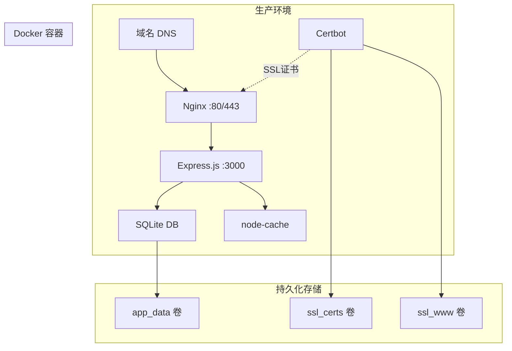

# 部署指南

本文档提供 Obsidian Publishing System 的完整部署指南，包括 Docker 配置、环境变量设置、CI/CD 流程和运维最佳实践。

## 📋 部署概述

Obsidian Publishing System 支持多种部署方案，推荐使用 Docker Compose 进行生产部署，提供自动化的 SSL 证书管理和高可用性配置。

### 部署架构



## 🚀 快速部署

### 前置要求

- **服务器**: 最小 1GB RAM, 10GB 存储空间
- **域名**: 已配置指向服务器的域名
- **软件**: Docker 和 Docker Compose
- **端口**: 80, 443 端口可用

### 一键部署脚本

系统提供了智能部署脚本 `deploy.sh`，支持多种部署模式：

```bash
# 克隆仓库
git clone https://github.com/ilovethw3/publish-obsidian-plugin.git
cd publish-obsidian-plugin

# 配置环境变量
cp .env.example .env
nano .env  # 编辑配置

# 智能部署（推荐）
./deploy.sh deploy

# 或者选择特定模式：
./deploy.sh deploy-prod    # 生产模式（预构建镜像）
./deploy.sh deploy-dev     # 开发模式（从源码构建）
```

### 环境变量配置

创建并编辑 `.env` 文件：

```bash
# .env 文件示例
DOMAIN=your-domain.com
LETSENCRYPT_EMAIL=your-email@example.com
CORS_ORIGIN=https://your-domain.com
NODE_ENV=production
VERSION=latest

# 可选配置
COMPOSE_FILE=docker-compose.yml
LOG_LEVEL=info
DB_PATH=./server/database/posts.db
```

**关键配置说明:**

| 变量 | 描述 | 示例 |
|------|------|------|
| `DOMAIN` | 你的域名 | `share.example.com` |
| `LETSENCRYPT_EMAIL` | Let's Encrypt 通知邮箱 | `admin@example.com` |
| `CORS_ORIGIN` | CORS 允许的来源 | `https://share.example.com` |
| `NODE_ENV` | 运行环境 | `production` |
| `VERSION` | Docker 镜像版本 | `latest` 或 `v1.0.0` |

## 🐳 Docker 配置详解

### Docker Compose 架构

```yaml
# docker-compose.yml
version: '3.8'

services:
  app:
    image: candy0327/obsidian-publisher-server:${VERSION:-latest}
    container_name: obsidian-publisher-app
    restart: unless-stopped
    environment:
      - NODE_ENV=${NODE_ENV:-production}
      - CORS_ORIGIN=${CORS_ORIGIN}
    volumes:
      - app_data:/app/database
      - app_logs:/app/logs
    networks:
      - obsidian_network
    healthcheck:
      test: ["CMD", "curl", "-f", "http://localhost:3000/health"]
      interval: 30s
      timeout: 10s
      retries: 3
      start_period: 40s

  nginx:
    image: nginx:alpine
    container_name: obsidian-publisher-nginx
    restart: unless-stopped
    ports:
      - "80:80"
      - "443:443"
    volumes:
      - ./nginx-simple.conf:/etc/nginx/conf.d/default.conf:ro
      - ssl_certs:/etc/letsencrypt:ro
      - ssl_www:/var/www/certbot:ro
    networks:
      - obsidian_network
    depends_on:
      app:
        condition: service_healthy

  certbot:
    image: certbot/certbot
    container_name: obsidian-publisher-certbot
    volumes:
      - ssl_certs:/etc/letsencrypt
      - ssl_www:/var/www/certbot
    command: certonly --webroot --webroot-path=/var/www/certbot --email ${LETSENCRYPT_EMAIL} --agree-tos --no-eff-email -d ${DOMAIN}

  certbot-renew:
    image: certbot/certbot
    container_name: obsidian-publisher-certbot-renew
    volumes:
      - ssl_certs:/etc/letsencrypt
      - ssl_www:/var/www/certbot
    entrypoint: |
      sh -c 'trap exit TERM; while :; do certbot renew --webroot --webroot-path=/var/www/certbot; sleep 12h & wait $${!}; done;'

volumes:
  app_data:
    driver: local
    driver_opts:
      type: none
      o: bind
      device: ./server/database
  app_logs:
    driver: local
  ssl_certs:
    driver: local
  ssl_www:
    driver: local

networks:
  obsidian_network:
    driver: bridge
```

### Nginx 配置

```nginx
# nginx-simple.conf
server {
    listen 80;
    server_name ${DOMAIN};
    
    # Let's Encrypt ACME 挑战
    location /.well-known/acme-challenge/ {
        root /var/www/certbot;
    }
    
    # 重定向到 HTTPS
    location / {
        return 301 https://$server_name$request_uri;
    }
}

server {
    listen 443 ssl http2;
    server_name ${DOMAIN};
    
    # SSL 配置
    ssl_certificate /etc/letsencrypt/live/${DOMAIN}/fullchain.pem;
    ssl_certificate_key /etc/letsencrypt/live/${DOMAIN}/privkey.pem;
    ssl_protocols TLSv1.2 TLSv1.3;
    ssl_ciphers ECDHE-RSA-AES256-GCM-SHA512:DHE-RSA-AES256-GCM-SHA512:ECDHE-RSA-AES256-GCM-SHA384:DHE-RSA-AES256-GCM-SHA384;
    ssl_prefer_server_ciphers off;
    ssl_session_cache shared:SSL:10m;
    ssl_session_timeout 10m;
    
    # 安全头
    add_header Strict-Transport-Security "max-age=31536000; includeSubDomains" always;
    add_header X-Frame-Options DENY always;
    add_header X-Content-Type-Options nosniff always;
    add_header X-XSS-Protection "1; mode=block" always;
    add_header Referrer-Policy "strict-origin-when-cross-origin" always;
    
    # 客户端请求体大小限制（支持大笔记）
    client_max_body_size 25M;
    
    # 代理配置
    location / {
        proxy_pass http://app:3000;
        proxy_http_version 1.1;
        proxy_set_header Upgrade $http_upgrade;
        proxy_set_header Connection 'upgrade';
        proxy_set_header Host $host;
        proxy_set_header X-Real-IP $remote_addr;
        proxy_set_header X-Forwarded-For $proxy_add_x_forwarded_for;
        proxy_set_header X-Forwarded-Proto $scheme;
        proxy_cache_bypass $http_upgrade;
        
        # 超时配置
        proxy_connect_timeout 60s;
        proxy_send_timeout 60s;
        proxy_read_timeout 60s;
    }
    
    # 健康检查端点缓存
    location /health {
        proxy_pass http://app:3000/health;
        proxy_cache_valid 200 1m;
        add_header X-Cache-Status $upstream_cache_status;
    }
    
    # 静态内容缓存
    location ~* \.(css|js|png|jpg|jpeg|gif|ico|svg)$ {
        proxy_pass http://app:3000;
        expires 1y;
        add_header Cache-Control "public, immutable";
    }
}
```

## 🛠️ 部署脚本详解

### deploy.sh 脚本功能

```bash
#!/bin/bash

# Obsidian Publishing System 部署脚本
# 支持多种部署模式和运维操作

set -e

# 颜色输出
RED='\033[0;31m'
GREEN='\033[0;32m'
YELLOW='\033[1;33m'
NC='\033[0m' # No Color

# 日志函数
log_info() { echo -e "${GREEN}[INFO]${NC} $1"; }
log_warn() { echo -e "${YELLOW}[WARN]${NC} $1"; }
log_error() { echo -e "${RED}[ERROR]${NC} $1"; }

# 检查前置条件
check_prerequisites() {
    log_info "检查前置条件..."
    
    if ! command -v docker &> /dev/null; then
        log_error "Docker 未安装，请先安装 Docker"
        exit 1
    fi
    
    if ! command -v docker-compose &> /dev/null; then
        log_error "Docker Compose 未安装，请先安装 Docker Compose"
        exit 1
    fi
    
    if [[ ! -f .env ]]; then
        log_error "未找到 .env 文件，请从 .env.example 复制并配置"
        exit 1
    fi
    
    log_info "前置条件检查通过"
}

# 初始化数据库
init_database() {
    log_info "初始化数据库..."
    
    # 创建数据库目录
    mkdir -p ./server/database
    
    # 创建数据库文件（如果不存在）
    if [[ ! -f ./server/database/posts.db ]]; then
        touch ./server/database/posts.db
        log_info "创建数据库文件: ./server/database/posts.db"
    fi
    
    # 设置正确的权限（Docker 容器运行用户 UID 1001）
    sudo chown -R 1001:1001 ./server/database
    log_info "设置数据库权限: 1001:1001"
}

# 智能部署（优先使用预构建镜像）
deploy_smart() {
    log_info "开始智能部署..."
    
    if deploy_prod; then
        log_info "智能部署完成（使用预构建镜像）"
    else
        log_warn "预构建镜像不可用，回退到开发部署"
        deploy_dev
    fi
}

# 生产部署（预构建镜像）
deploy_prod() {
    log_info "生产部署：使用预构建镜像..."
    
    # 拉取最新镜像
    if docker-compose pull app; then
        docker-compose up -d
        return 0
    else
        log_error "无法拉取预构建镜像"
        return 1
    fi
}

# 开发部署（从源码构建）
deploy_dev() {
    log_info "开发部署：从源码构建..."
    
    # 使用开发配置文件
    export COMPOSE_FILE=docker-compose.dev.yml
    docker-compose build app
    docker-compose up -d
}

# 停止服务
stop_services() {
    log_info "停止所有服务..."
    docker-compose down
    log_info "服务已停止"
}

# 重启服务
restart_services() {
    log_info "重启服务..."
    docker-compose restart
    log_info "服务已重启"
}

# 查看日志
view_logs() {
    local service=${1:-}
    
    if [[ -n "$service" ]]; then
        log_info "查看 $service 服务日志..."
        docker-compose logs -f "$service"
    else
        log_info "查看所有服务日志..."
        docker-compose logs -f
    fi
}

# 健康检查
health_check() {
    log_info "执行健康检查..."
    
    # 检查容器状态
    local containers=(
        "obsidian-publisher-app"
        "obsidian-publisher-nginx"
        "obsidian-publisher-certbot"
    )
    
    for container in "${containers[@]}"; do
        if docker ps --format "table {{.Names}}" | grep -q "$container"; then
            log_info "✓ $container 运行正常"
        else
            log_error "✗ $container 未运行"
        fi
    done
    
    # 检查健康端点
    local domain=$(grep DOMAIN .env | cut -d'=' -f2)
    if curl -sf "https://$domain/health" > /dev/null; then
        log_info "✓ 健康检查端点正常"
    else
        log_error "✗ 健康检查端点异常"
    fi
}

# 备份数据
backup_data() {
    local backup_dir="./backups/$(date +%Y%m%d_%H%M%S)"
    
    log_info "创建数据备份到: $backup_dir"
    mkdir -p "$backup_dir"
    
    # 备份数据库
    cp -r ./server/database "$backup_dir/"
    
    # 备份配置文件
    cp .env "$backup_dir/"
    cp docker-compose.yml "$backup_dir/"
    
    # 创建备份信息文件
    cat > "$backup_dir/backup_info.txt" << EOF
Backup created: $(date)
Git commit: $(git rev-parse HEAD 2>/dev/null || echo "N/A")
Docker images:
$(docker-compose images)
EOF
    
    log_info "备份完成: $backup_dir"
}

# 恢复数据
restore_data() {
    local backup_dir=$1
    
    if [[ -z "$backup_dir" ]] || [[ ! -d "$backup_dir" ]]; then
        log_error "请指定有效的备份目录"
        exit 1
    fi
    
    log_warn "即将从 $backup_dir 恢复数据，这将覆盖当前数据"
    read -p "确认继续？(y/N) " -n 1 -r
    echo
    
    if [[ $REPLY =~ ^[Yy]$ ]]; then
        log_info "停止服务..."
        docker-compose down
        
        log_info "恢复数据库..."
        rm -rf ./server/database
        cp -r "$backup_dir/database" ./server/
        
        log_info "恢复配置..."
        cp "$backup_dir/.env" ./
        
        log_info "重启服务..."
        docker-compose up -d
        
        log_info "数据恢复完成"
    else
        log_info "恢复操作已取消"
    fi
}

# 更新系统
update_system() {
    log_info "更新系统..."
    
    # 拉取最新代码
    git pull origin main
    
    # 拉取最新镜像
    docker-compose pull
    
    # 重新部署
    docker-compose up -d
    
    log_info "系统更新完成"
}

# SSL 证书管理
manage_ssl() {
    local action=$1
    
    case $action in
        "renew")
            log_info "手动续订 SSL 证书..."
            docker-compose exec certbot certbot renew --webroot --webroot-path=/var/www/certbot
            docker-compose exec nginx nginx -s reload
            ;;
        "force-renew")
            log_info "强制续订 SSL 证书..."
            docker-compose exec certbot certbot renew --force-renewal --webroot --webroot-path=/var/www/certbot
            docker-compose exec nginx nginx -s reload
            ;;
        "test")
            log_info "测试 SSL 证书续订..."
            docker-compose exec certbot certbot renew --dry-run --webroot --webroot-path=/var/www/certbot
            ;;
        *)
            log_error "未知的 SSL 操作: $action"
            log_info "可用操作: renew, force-renew, test"
            ;;
    esac
}

# 显示帮助信息
show_help() {
    cat << EOF
Obsidian Publishing System 部署脚本

用法: $0 <command> [options]

命令:
  deploy              智能部署（推荐）
  deploy-prod         生产部署（预构建镜像）
  deploy-dev          开发部署（从源码构建）
  stop                停止所有服务
  restart             重启所有服务
  logs [service]      查看日志
  health              健康检查
  backup              备份数据
  restore <dir>       从备份恢复数据
  update              更新系统
  ssl <action>        SSL 证书管理
  help                显示此帮助信息

示例:
  $0 deploy           # 智能部署
  $0 logs app         # 查看应用日志
  $0 ssl renew        # 续订 SSL 证书
  $0 backup           # 创建数据备份

EOF
}

# 主函数
main() {
    local command=${1:-help}
    
    case $command in
        "deploy")
            check_prerequisites
            init_database
            deploy_smart
            health_check
            ;;
        "deploy-prod")
            check_prerequisites
            init_database
            deploy_prod
            health_check
            ;;
        "deploy-dev")
            check_prerequisites
            init_database
            deploy_dev
            health_check
            ;;
        "stop")
            stop_services
            ;;
        "restart")
            restart_services
            health_check
            ;;
        "logs")
            view_logs $2
            ;;
        "health")
            health_check
            ;;
        "backup")
            backup_data
            ;;
        "restore")
            restore_data $2
            ;;
        "update")
            update_system
            health_check
            ;;
        "ssl")
            manage_ssl $2
            ;;
        "help"|*)
            show_help
            ;;
    esac
}

# 执行主函数
main "$@"
```

## 🔄 CI/CD 流程

### GitHub Actions 工作流

```yaml
# .github/workflows/docker-build.yml
name: Build and Push Docker Image

on:
  push:
    branches: [ main, master ]
    paths:
      - 'server/**'
      - 'shared/**'
      - 'docker-compose*.yml'
      - '.github/workflows/docker-build.yml'
    tags: [ 'v*' ]
  pull_request:
    branches: [ main, master ]
    paths:
      - 'server/**'
      - 'shared/**'
      - 'docker-compose*.yml'

env:
  REGISTRY: docker.io
  IMAGE_NAME: candy0327/obsidian-publisher-server

jobs:
  build-and-push:
    runs-on: ubuntu-latest
    permissions:
      contents: read
      packages: write
      security-events: write

    steps:
    - name: Checkout repository
      uses: actions/checkout@v4

    - name: Set up Docker Buildx
      uses: docker/setup-buildx-action@v3

    - name: Log in to Docker Hub
      if: github.event_name != 'pull_request'
      uses: docker/login-action@v3
      with:
        registry: ${{ env.REGISTRY }}
        username: ${{ secrets.DOCKER_USERNAME }}
        password: ${{ secrets.DOCKER_PASSWORD }}

    - name: Extract metadata
      id: meta
      uses: docker/metadata-action@v5
      with:
        images: ${{ env.REGISTRY }}/${{ env.IMAGE_NAME }}
        tags: |
          type=ref,event=branch
          type=ref,event=pr
          type=semver,pattern={{version}}
          type=semver,pattern={{major}}.{{minor}}
          type=semver,pattern={{major}}
          type=raw,value=latest,enable={{is_default_branch}}

    - name: Build and push Docker image
      uses: docker/build-push-action@v5
      with:
        context: ./server
        platforms: linux/amd64,linux/arm64
        push: ${{ github.event_name != 'pull_request' }}
        tags: ${{ steps.meta.outputs.tags }}
        labels: ${{ steps.meta.outputs.labels }}
        cache-from: type=gha
        cache-to: type=gha,mode=max

    - name: Run Trivy vulnerability scanner
      uses: aquasecurity/trivy-action@master
      with:
        image-ref: ${{ env.REGISTRY }}/${{ env.IMAGE_NAME }}:latest
        format: 'sarif'
        output: 'trivy-results.sarif'

    - name: Upload Trivy scan results to GitHub Security tab
      uses: github/codeql-action/upload-sarif@v3
      if: always()
      with:
        sarif_file: 'trivy-results.sarif'
```

### 构建优化

```dockerfile
# server/Dockerfile
FROM node:18-alpine AS builder

WORKDIR /app

# 复制依赖文件
COPY package*.json ./
COPY ../shared/package*.json ../shared/

# 安装依赖
RUN npm ci --only=production && npm cache clean --force

# 复制源码
COPY . .
COPY ../shared ../shared

# 构建应用
RUN npm run build

# 生产镜像
FROM node:18-alpine AS runtime

# 创建应用用户
RUN addgroup -g 1001 -S nodejs && \
    adduser -S nextjs -u 1001

WORKDIR /app

# 复制构建产物
COPY --from=builder --chown=nextjs:nodejs /app/dist ./dist
COPY --from=builder --chown=nextjs:nodejs /app/node_modules ./node_modules
COPY --from=builder --chown=nextjs:nodejs /app/package.json ./

# 创建数据目录
RUN mkdir -p /app/database && chown nextjs:nodejs /app/database

# 健康检查
HEALTHCHECK --interval=30s --timeout=10s --start-period=40s --retries=3 \
  CMD curl -f http://localhost:3000/health || exit 1

# 切换到非 root 用户
USER nextjs

# 暴露端口
EXPOSE 3000

# 启动应用
CMD ["npm", "start"]
```

## 📊 监控和运维

### 日志管理

```bash
# 查看实时日志
docker-compose logs -f

# 查看特定服务日志
docker-compose logs -f app
docker-compose logs -f nginx

# 日志轮转配置
# 在 docker-compose.yml 中添加:
services:
  app:
    logging:
      driver: "json-file"
      options:
        max-size: "10m"
        max-file: "3"
```

### 监控脚本

```bash
#!/bin/bash
# monitor.sh - 系统监控脚本

# 检查服务状态
check_services() {
    local services=("obsidian-publisher-app" "obsidian-publisher-nginx")
    
    for service in "${services[@]}"; do
        if ! docker ps --format "{{.Names}}" | grep -q "$service"; then
            echo "ALERT: $service is not running"
            # 发送通知（邮件、Slack 等）
            restart_service "$service"
        fi
    done
}

# 检查磁盘空间
check_disk_space() {
    local threshold=80
    local usage=$(df / | awk 'NR==2 {print $5}' | sed 's/%//')
    
    if [ "$usage" -gt "$threshold" ]; then
        echo "ALERT: Disk usage is ${usage}% (threshold: ${threshold}%)"
        # 清理日志文件
        docker system prune -f
    fi
}

# 检查数据库大小
check_database_size() {
    local db_path="./server/database/posts.db"
    local max_size_mb=1000
    
    if [ -f "$db_path" ]; then
        local size_mb=$(du -m "$db_path" | cut -f1)
        if [ "$size_mb" -gt "$max_size_mb" ]; then
            echo "ALERT: Database size is ${size_mb}MB (max: ${max_size_mb}MB)"
        fi
    fi
}

# 自动备份
auto_backup() {
    local backup_dir="./backups/auto_$(date +%Y%m%d_%H%M%S)"
    mkdir -p "$backup_dir"
    
    cp -r ./server/database "$backup_dir/"
    cp .env "$backup_dir/"
    
    # 清理旧备份（保留7天）
    find ./backups -type d -name "auto_*" -mtime +7 -exec rm -rf {} \;
}

# 主监控循环
main() {
    while true; do
        echo "$(date): Running system check..."
        
        check_services
        check_disk_space
        check_database_size
        
        # 每天凌晨2点自动备份
        if [ "$(date +%H:%M)" = "02:00" ]; then
            auto_backup
        fi
        
        # 每5分钟检查一次
        sleep 300
    done
}

main "$@"
```

### 性能优化

```bash
# 优化 Docker 配置
# 在 /etc/docker/daemon.json 中添加:
{
  "log-driver": "json-file",
  "log-opts": {
    "max-size": "10m",
    "max-file": "3"
  },
  "storage-driver": "overlay2",
  "storage-opts": [
    "overlay2.override_kernel_check=true"
  ]
}

# 系统级优化
echo 'vm.max_map_count=262144' >> /etc/sysctl.conf
echo 'fs.file-max=65536' >> /etc/sysctl.conf
sysctl -p
```

## 🔒 安全配置

### 防火墙设置

```bash
# UFW 防火墙配置
ufw --force reset
ufw default deny incoming
ufw default allow outgoing

# 开放必要端口
ufw allow 22/tcp    # SSH
ufw allow 80/tcp    # HTTP
ufw allow 443/tcp   # HTTPS

# 启用防火墙
ufw --force enable
ufw status verbose
```

### SSL 证书最佳实践

```bash
# 检查证书有效期
openssl x509 -in /path/to/cert.pem -text -noout | grep "Not After"

# 测试 SSL 配置
curl -I https://your-domain.com
openssl s_client -connect your-domain.com:443 -servername your-domain.com
```

### 定期安全更新

```bash
#!/bin/bash
# security-update.sh

# 更新系统包
apt update && apt upgrade -y

# 更新 Docker 镜像
docker-compose pull

# 重启服务
docker-compose up -d

# 清理无用的镜像
docker image prune -a -f
```

## 🐛 故障排除

### 常见问题

1. **SSL 证书获取失败**
   ```bash
   # 检查域名 DNS 记录
   nslookup your-domain.com
   
   # 手动获取证书
   docker-compose run --rm certbot certonly --webroot --webroot-path=/var/www/certbot --email your-email@example.com --agree-tos --no-eff-email -d your-domain.com
   ```

2. **数据库权限问题**
   ```bash
   # 修复数据库权限
   sudo chown -R 1001:1001 ./server/database
   chmod 755 ./server/database
   chmod 644 ./server/database/posts.db
   ```

3. **容器无法启动**
   ```bash
   # 查看详细错误信息
   docker-compose logs app
   
   # 检查配置文件
   docker-compose config
   
   # 重建容器
   docker-compose down && docker-compose up -d --force-recreate
   ```

4. **CORS 错误**
   ```bash
   # 检查环境变量
   grep CORS_ORIGIN .env
   
   # 检查 Nginx 配置
   docker-compose exec nginx nginx -t
   ```

### 紧急恢复

```bash
# 紧急恢复脚本
#!/bin/bash
# emergency-recovery.sh

echo "开始紧急恢复..."

# 停止所有服务
docker-compose down

# 检查磁盘空间
df -h

# 清理 Docker 资源
docker system prune -a -f

# 从最新备份恢复
latest_backup=$(ls -t ./backups/ | head -n1)
if [ -n "$latest_backup" ]; then
    echo "从备份恢复: $latest_backup"
    ./deploy.sh restore "./backups/$latest_backup"
else
    echo "未找到备份，重新部署..."
    ./deploy.sh deploy
fi

echo "紧急恢复完成"
```

## 📈 扩展和优化

### 高可用性部署

```yaml
# docker-compose.ha.yml - 高可用性配置
version: '3.8'

services:
  app:
    image: candy0327/obsidian-publisher-server:latest
    deploy:
      replicas: 3
      restart_policy:
        condition: on-failure
        delay: 5s
        max_attempts: 3
      update_config:
        parallelism: 1
        delay: 10s
    networks:
      - obsidian_network

  nginx:
    image: nginx:alpine
    depends_on:
      - app
    deploy:
      replicas: 2
      restart_policy:
        condition: on-failure
    networks:
      - obsidian_network

  postgres:
    image: postgres:15-alpine
    environment:
      POSTGRES_DB: obsidian_publisher
      POSTGRES_USER: ${DB_USER}
      POSTGRES_PASSWORD: ${DB_PASS}
    volumes:
      - postgres_data:/var/lib/postgresql/data
    networks:
      - obsidian_network

  redis:
    image: redis:7-alpine
    networks:
      - obsidian_network

volumes:
  postgres_data:

networks:
  obsidian_network:
    driver: overlay
```

### 监控集成

```yaml
# monitoring.yml - 监控服务
version: '3.8'

services:
  prometheus:
    image: prom/prometheus
    volumes:
      - ./monitoring/prometheus.yml:/etc/prometheus/prometheus.yml
    ports:
      - "9090:9090"

  grafana:
    image: grafana/grafana
    environment:
      - GF_SECURITY_ADMIN_PASSWORD=admin
    volumes:
      - grafana_data:/var/lib/grafana
    ports:
      - "3001:3000"

  node-exporter:
    image: prom/node-exporter
    ports:
      - "9100:9100"

volumes:
  grafana_data:
```

---

> 📝 **注意**: 本部署指南基于 DeepWiki 分析和实际生产环境经验编写。请根据你的具体需求调整配置参数。如有问题，请参考故障排除章节或提交 Issue。